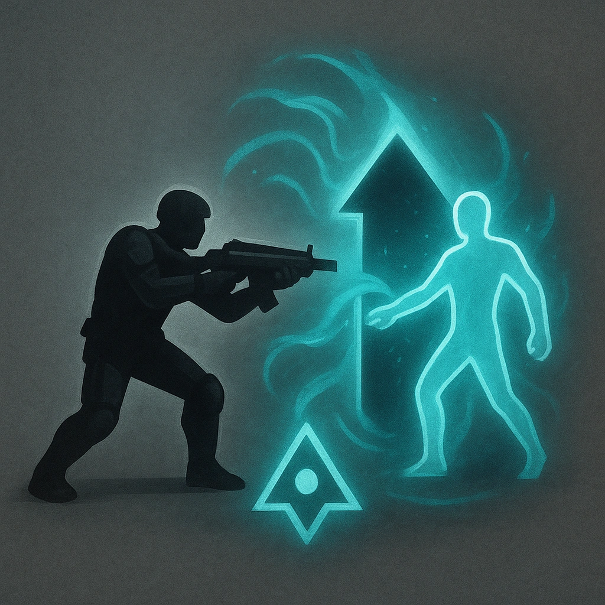

# Battle Teleport

## Description
*
Before or after making a standard attack, you can <strong>mark a Stress</strong> to teleport to a location within Far range.
*

## Actions
- 
**Mark Stress** *Before or after making a standard attack, you can mark a Stress to teleport to a location within Far range.*

---

adversaries-features/Ranged
 
**UUID:** `Compendium.cybermancy.system.battle-teleport`

