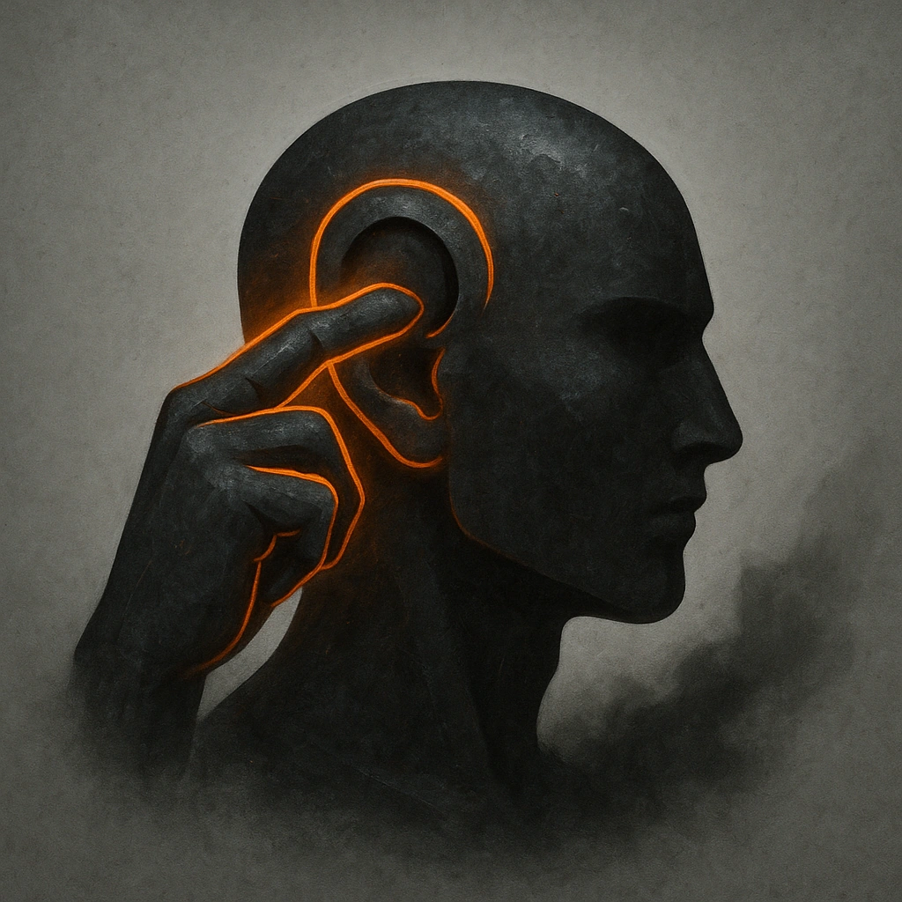

# Bend Ears

## Description
*
<strong>Mark a Stress</strong> to influence an NPC within Melee range with whispered words. That target’s opinion on one matter shifts toward the Advisor’s preference unless it is in direct opposition to the target’s motives.
*

## Actions
- 
**Mark Stress** *Mark a Stress to influence an NPC within Melee range with whispered words. That target’s opinion on one matter shifts toward the Advisor’s preference unless it is in direct opposition to the target’s motives.*

---

adversaries-features/Social
 
**UUID:** `Compendium.cybermancy.system.bend-ears`

