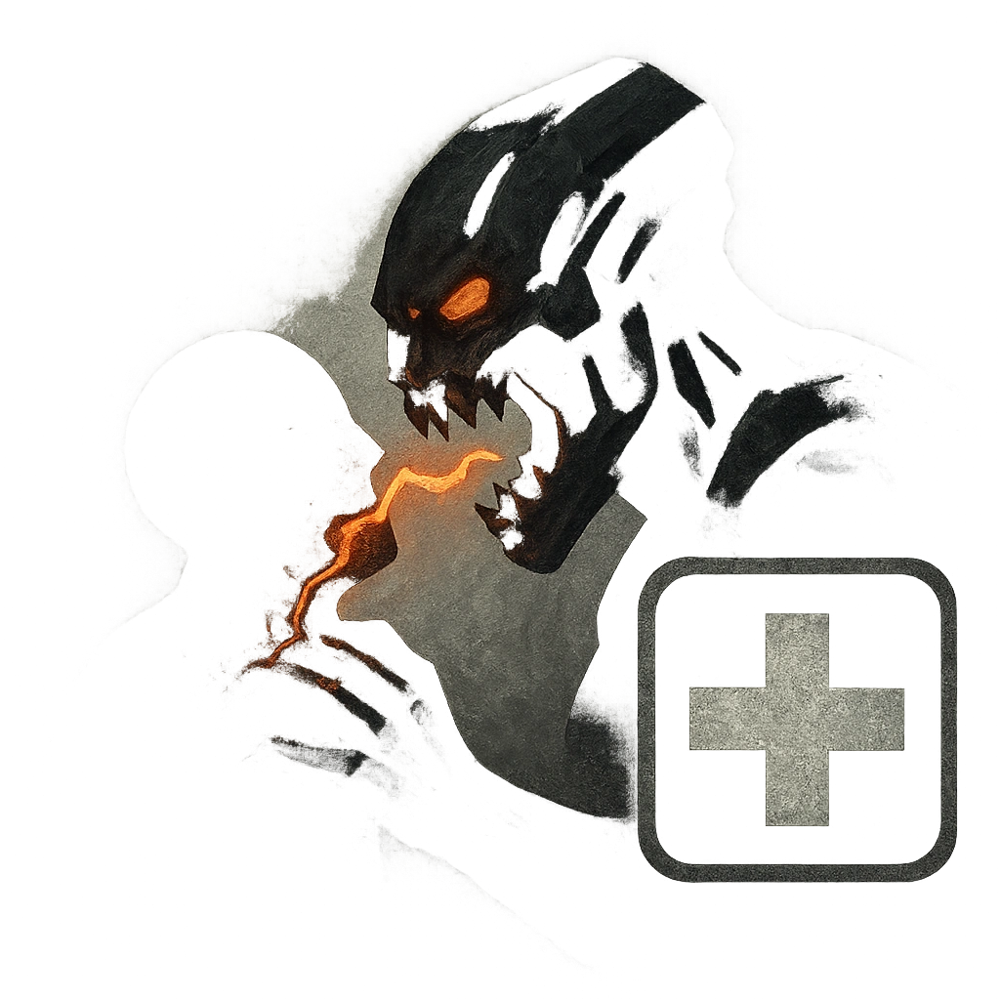

# Bite

## Description
*
<strong>Mark a Stress</strong> to make an attack against a target within Melee range. On a success, deal <strong>3d4+10</strong> physical damage and the target is <em>Restrained</em> until they break free with a successful Strength Roll.
*

## Actions
- 
**Attack** *Mark a Stress to make an attack against a target within Melee range. On a success, deal 3d4+10 physical damage and the target is Restrained until they break free with a successful Strength Roll.*

---

adversaries-features/Bruiser
 
**UUID:** `Compendium.cybermancy.system.bite`

