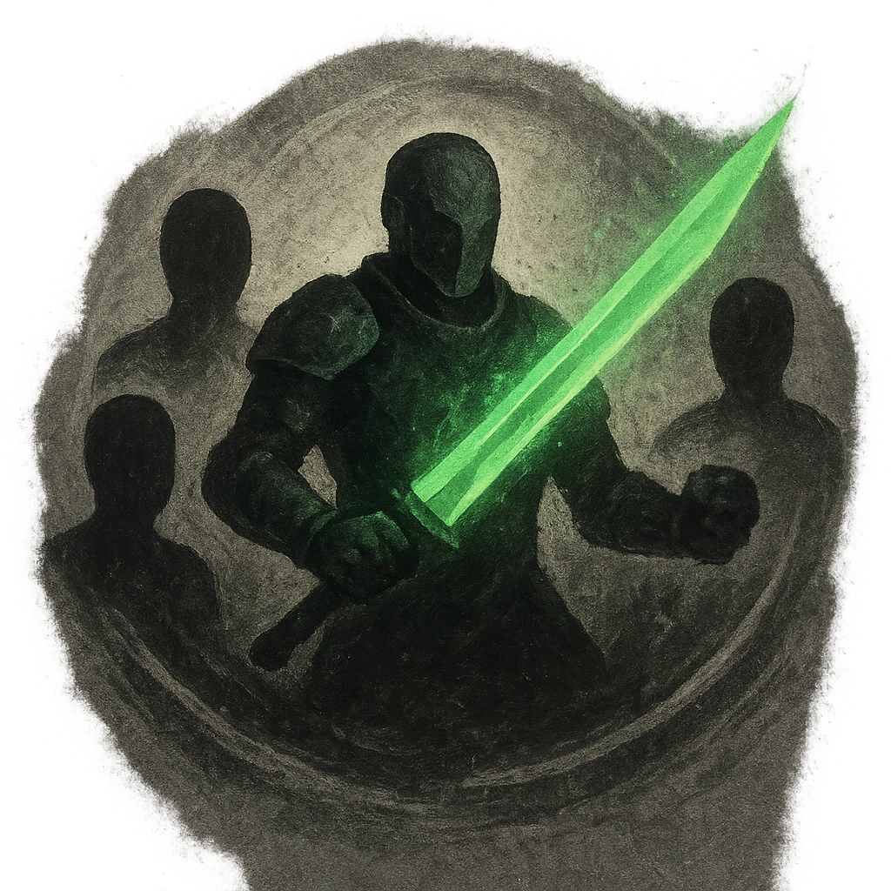

# Blade of the Forest

## Description
*
<strong>Spend a Fear</strong> to make an attack against all targets within Very Close range. Targets the Knight succeeds against take physical damage equal to <strong>[[/r 3d4]]</strong> + the target’s Major threshold.

@Template[type:emanation|range:vc]
*

## Actions
- 
**Attack** *vc]*

---

adversaries-features/Standard
 
**UUID:** `Compendium.cybermancy.system.blade-of-the-forest`

