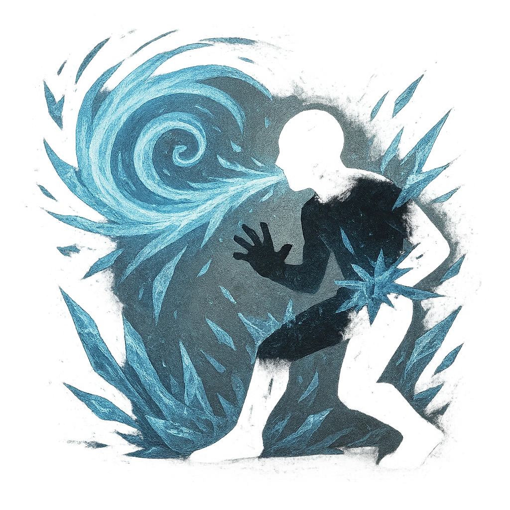

# Blizzard Breath

## Description
*
<strong>Spend 2 Fear</strong> to release an icy whorl in front of the Dragon within Close range. All targets in this area must make an Agility Reaction Roll. Targets who fail take <strong>4d6+5</strong> magic damage and are Restrained by ice until they break free with a successful Strength Roll. Targets who succeed must mark 2 Stress or take half damage.

@Template[type:inFront|range:c]
*

## Actions
- 
**Roll Save** *c]*

---

adversaries-features/Solo
 
**UUID:** `Compendium.cybermancy.system.blizzard-breath`

