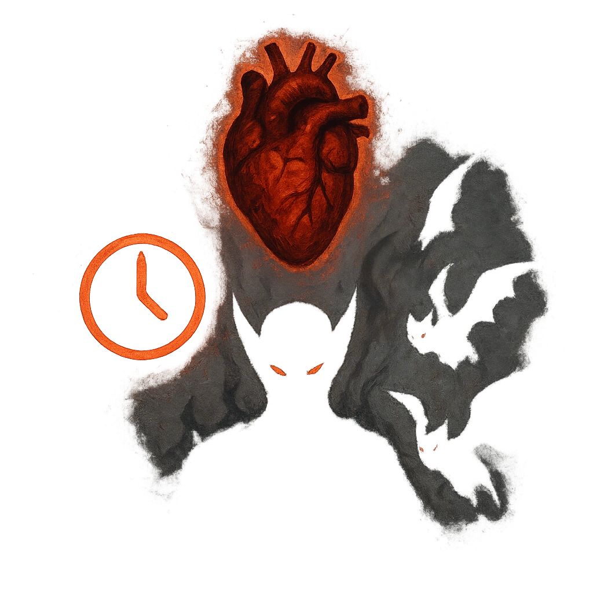

# Blood and Souls

## Description
*
Countdown (Loop 6). Activate the first time an attack is made within sight of the Demon. It ticks down when a PC takes a violent action. When it triggers, summon [[/r 1d4]]@UUID[Compendium.daggerheart.adversaries.Actor.3tqCjDwJAQ7JKqMb]{Minor Demons}, who appear at Close range.
*

## Actions
—

---

adversaries-features/Bruiser
 
**UUID:** `Compendium.cybermancy.system.blood-and-souls`

