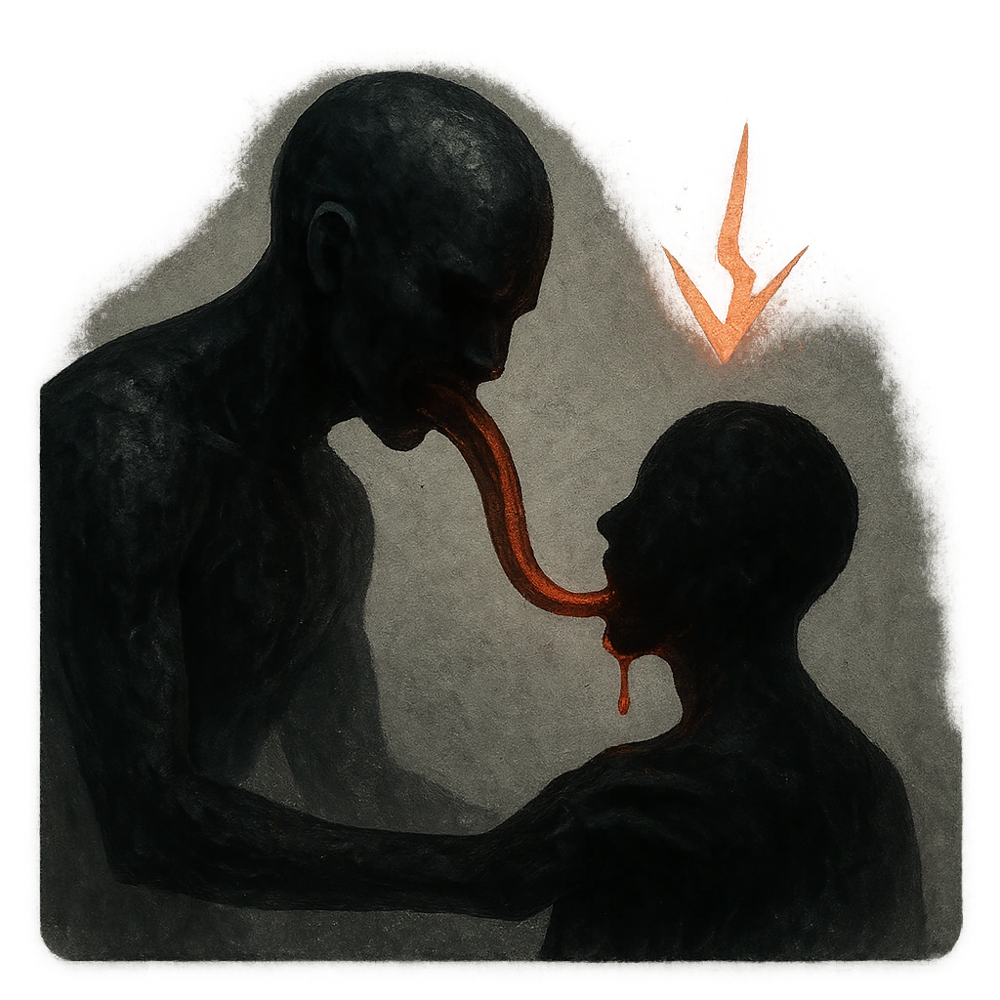

# Bloodsucker

## Description
*
When the Mosquitoes’ attack causes a target to mark HP, you can <strong>mark a Stress</strong> to force the target to mark an additional HP.
*

## Actions
- 
**Mark Stress** *When the Mosquitoes’ attack causes a target to mark HP, you can mark a Stress to force the target to mark an additional HP.*

---

adversaries-features/Horde
 
**UUID:** `Compendium.cybermancy.system.bloodsucker`

