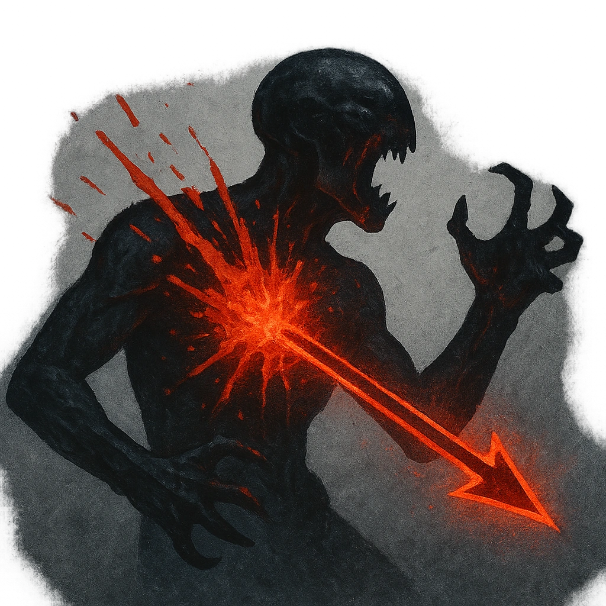

# Bloody Reprisal

## Description
*
When the Brawler marks 2 or more HP from an attack within Very Close range, you can make a standard attack against the attacker. On a success, the Brawler deals <strong>2d6+15</strong> physical damage instead of their standard damage.
*

## Actions
- 
**Attack** *When the Brawler marks 2 or more HP from an attack within Very Close range, you can make a standard attack against the attacker. On a success, the Brawler deals 2d6+15 physical damage instead of their standard damage.*

---

adversaries-features/Bruiser
 
**UUID:** `Compendium.cybermancy.system.bloody-reprisal`

