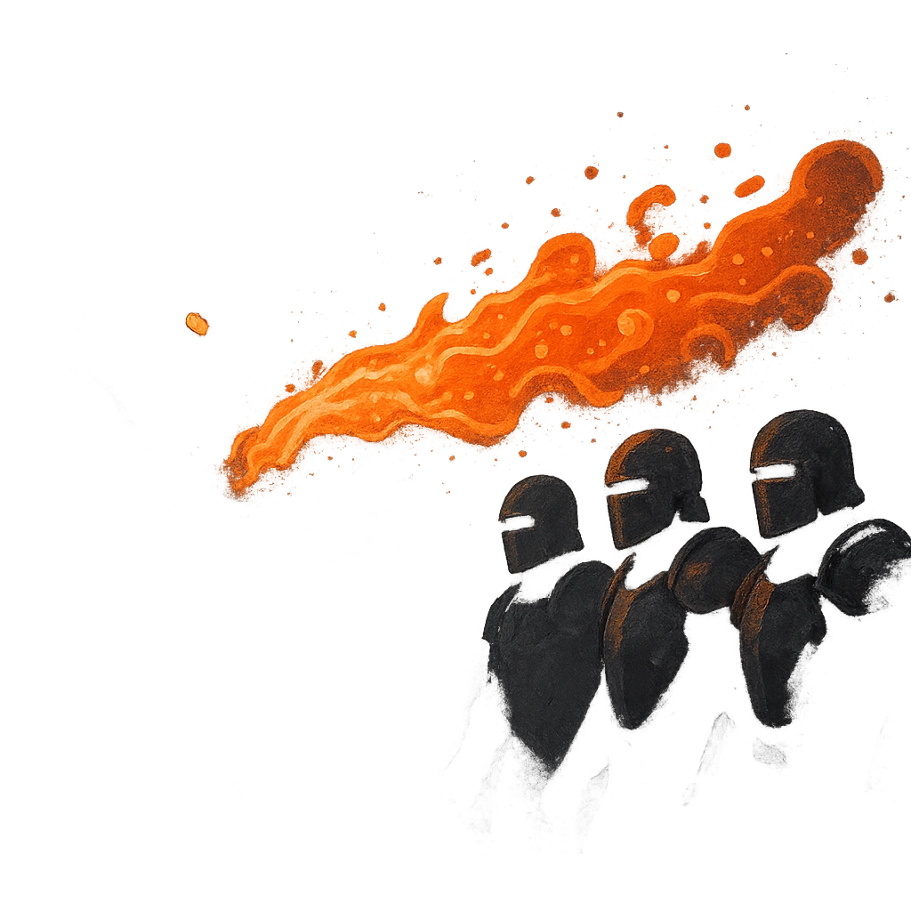

# Boiling Blast

## Description
*
<strong>Spend a Fear</strong> to spew a line of boiling water at any number of targets in a line up to Far range. All targets must succeed on an Agility Reaction Roll or take <strong>4d6+9</strong> physical damage. If a target marks an Armor Slot to reduce the damage, they must also mark a Stress.

@Template[type:ray|range:f]
*

## Actions
- 
**Attack** *f]*

---

adversaries-features/Solo
 
**UUID:** `Compendium.cybermancy.system.boiling-blast`

