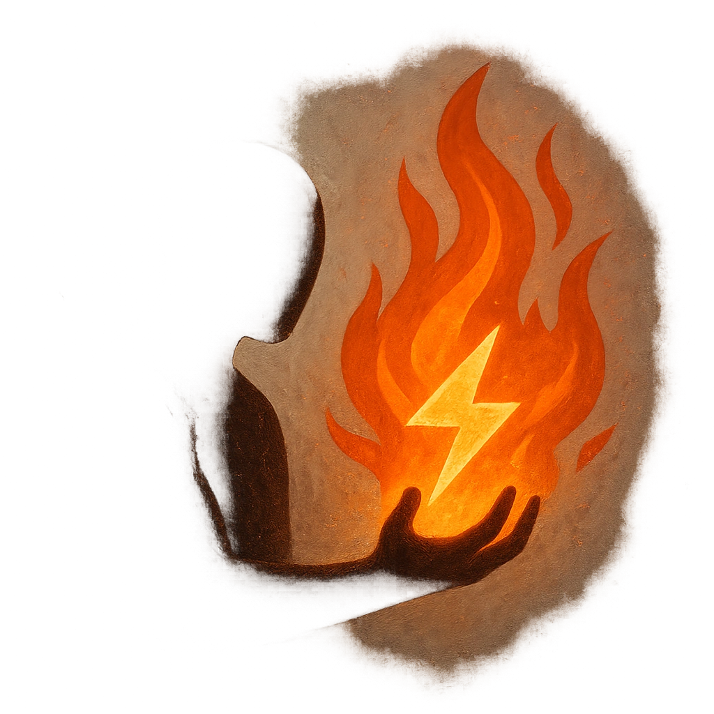

# Burning

## Description
*
When a creature within Melee range deals damage to the Ooze, they take <strong>1d6</strong> direct magic damage.
*

## Actions
- 
**Damage** *When a creature within Melee range deals damage to the Ooze, they take 1d6 direct magic damage.*

---

adversaries-features/Skulk
 
**UUID:** `Compendium.cybermancy.system.burning`

