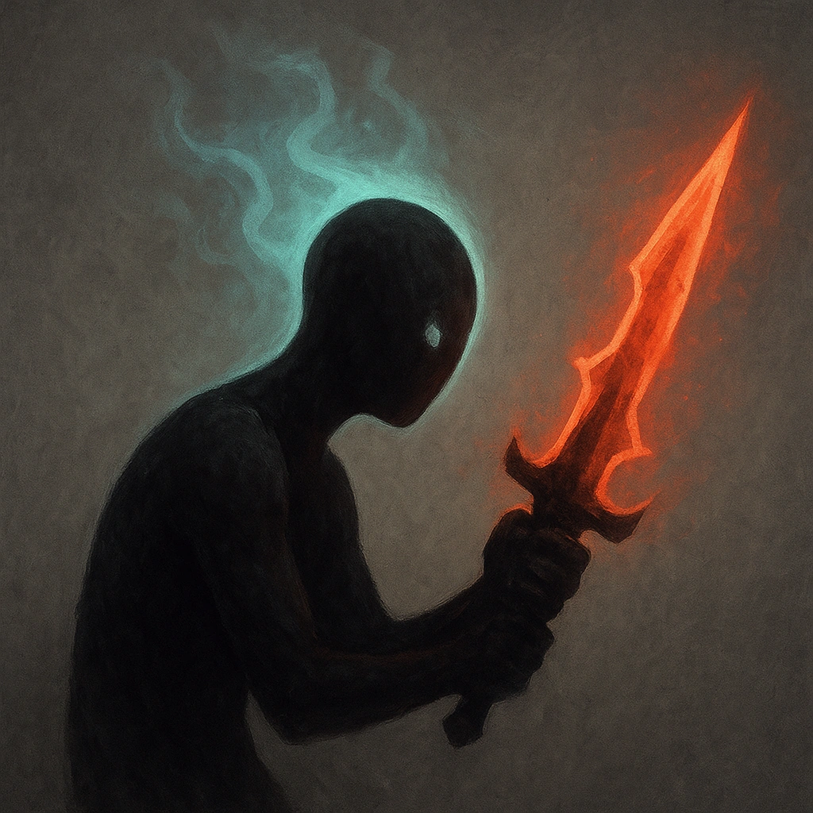

# Captive Audience

## Description
*
If the Siren makes a standard attack against a target Entranced by their song, the attack deals <strong>2d10+1</strong> damage instead of their standard damage.
*

## Actions
- 
**Attack** *If the Siren makes a standard attack against a target Entranced by their song, the attack deals 2d10+1 damage instead of their standard damage.*

---

adversaries-features/Skulk
 
**UUID:** `Compendium.cybermancy.system.captive-audience`

