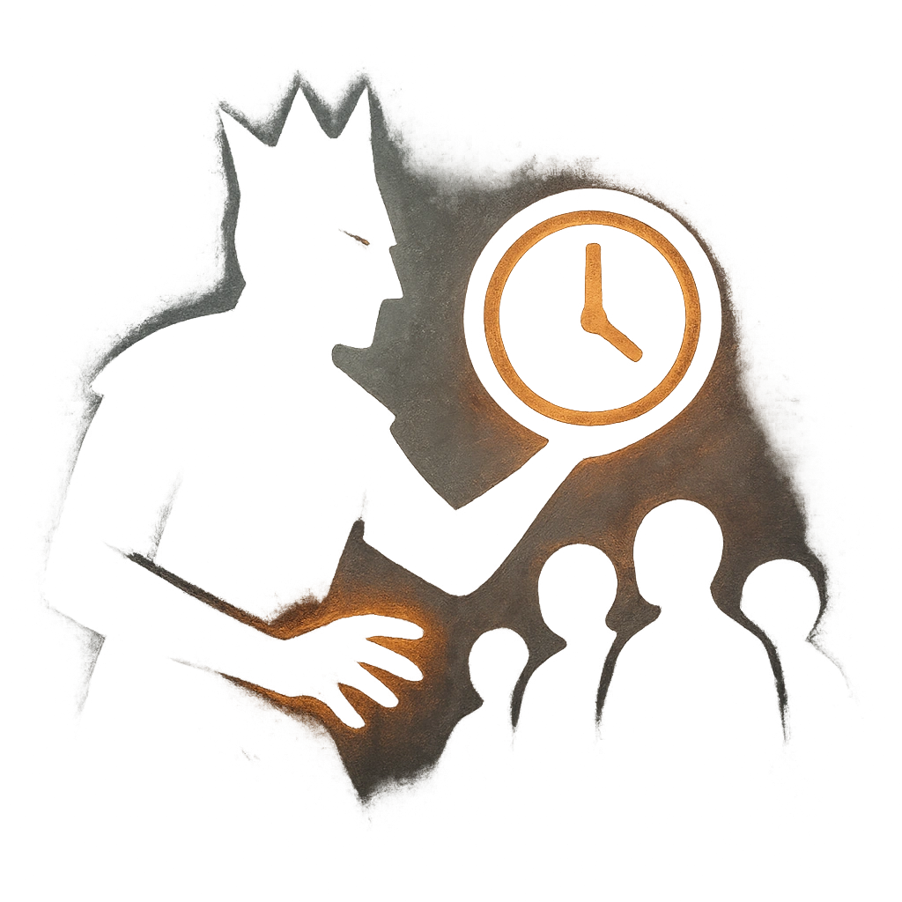

# Casus Belli

## Description
*
Long-Term Countdown (8). <strong>Spend a Fear</strong> to activate after the Monarch’s desire for war is first revealed. When it triggers, the Monarch has a reason to rally the nation to war and the support to act on that reason. You gain [[/r 1d4]]<strong> </strong>Fear.
*

## Actions
- 
**Spend Fear** **

---

adversaries-features/Social
 
**UUID:** `Compendium.cybermancy.system.casus-belli`

