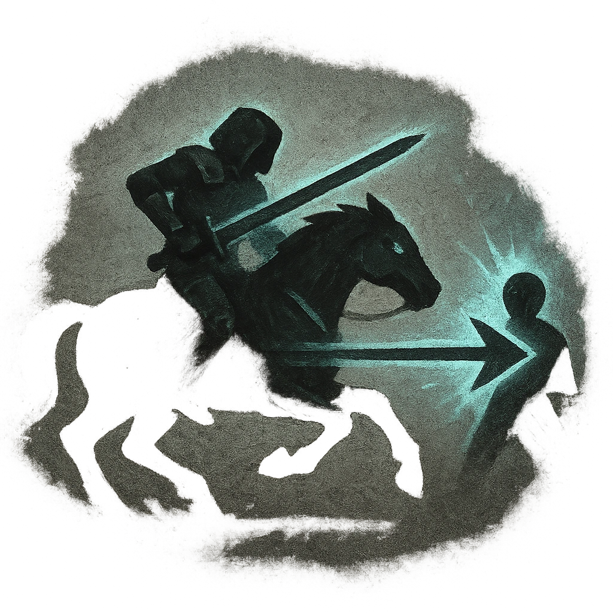

# Cavalry Charge

## Description
*
If the Knight is mounted, move up to Far range and make a standard attack against a target. On a success, deal <strong>2d8+4</strong> physical damage and the target must mark a Stress.
*

## Actions
- 
**Attack** *If the Knight is mounted, move up to Far range and make a standard attack against a target. On a success, deal 2d8+4 physical damage and the target must mark a Stress.*

---

adversaries-features/Leader
 
**UUID:** `Compendium.cybermancy.system.cavalry-charge`

