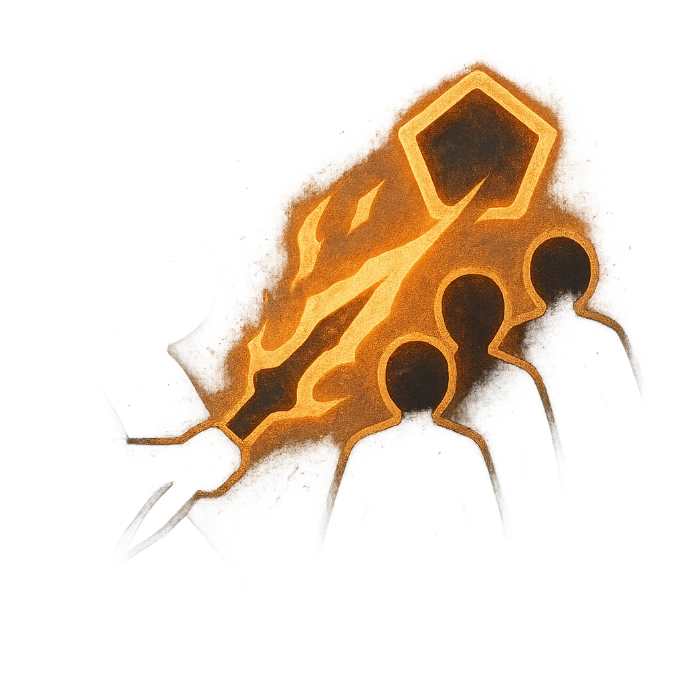

# Chaotic Flux

## Description
*
Make an attack against up to three targets within Very Close range. <strong>Mark a Stress</strong> to deal <strong>2d6+3</strong> magic damage to targets the Hexer succeeded against.
*

## Actions
- 
**Attack** *Make an attack against up to three targets within Very Close range. Mark a Stress to deal 2d6+3 magic damage to targets the Hexer succeeded against.*

---

adversaries-features/Support
 
**UUID:** `Compendium.cybermancy.system.chaotic-flux`

