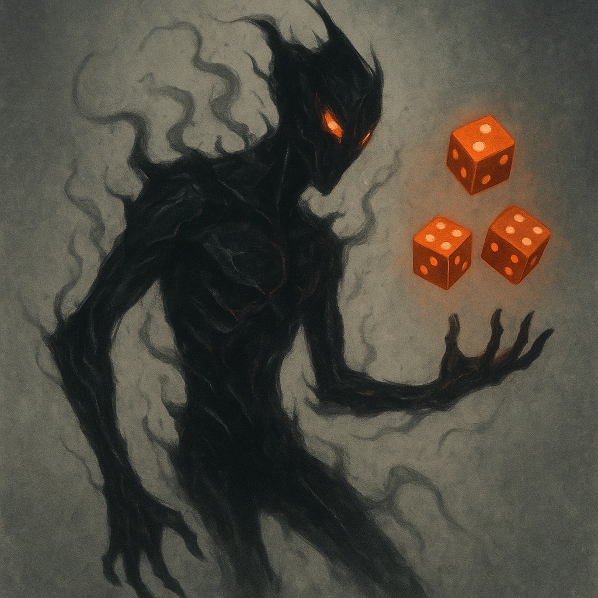

# Chaotic Form

## Description
*
When the Abomination attacks, roll <strong>2d4</strong> and use the result as their attack modifi er.
*

## Actions
—

---

adversaries-features/Bruiser
 
**UUID:** `Compendium.cybermancy.system.chaotic-form`

