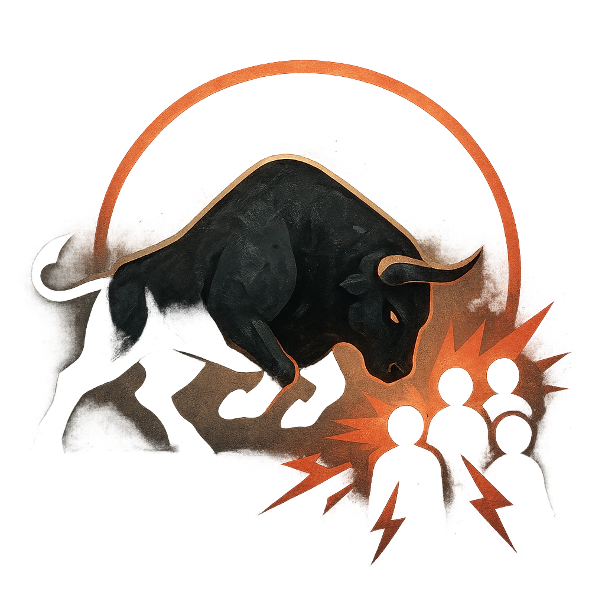

# Charging Bull

## Description
*
<strong>Mark a Stress</strong> to charge through a group within Close range and make an attack against all targets in the Minotaur’s path. Targets the Minotaur succeeds against take <strong>2d6+8</strong> physical damage and are knocked back to Very Far range. If a target is knocked into a solid object or another creature, they take an extra <strong>1d6</strong> damage (combine the damage).
*

## Actions
- 
**Attack** *Mark a Stress to charge through a group within Close range and make an attack against all targets in the Minotaur’s path. Targets the Minotaur succeeds against take 2d6+8 physical damage and are knocked back to Very Far range. If a target is knocked into a solid object or another creature, they take an extra 1d6 damage (combine the damage).*

- 
**Collision Damage** *If a target is knocked into a solid object or another creature, they take an extra 1d6 damage (combine the damage).*

---

adversaries-features/Bruiser
 
**UUID:** `Compendium.cybermancy.system.charging-bull`

