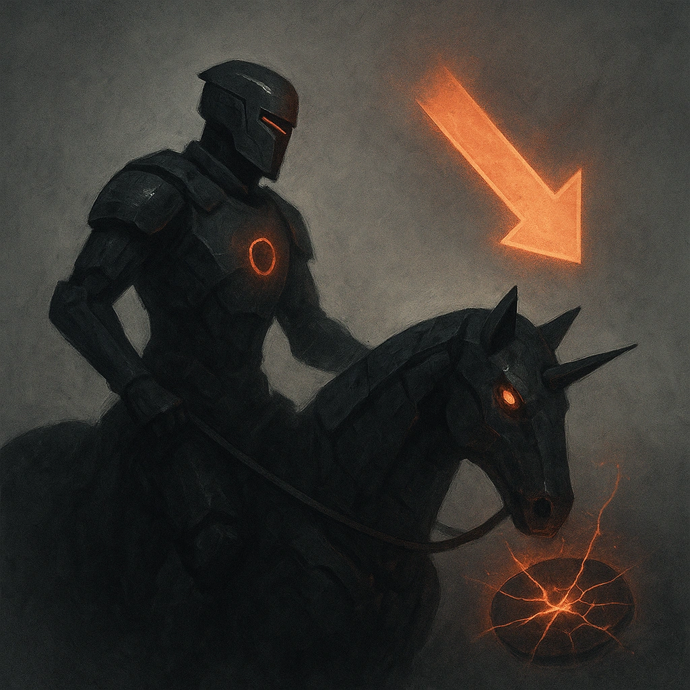

# Chevalier

## Description
*
While the Knight is on a mount, they gain a +2 bonus to their Difficulty. When they take Severe damage, they’re knocked from their mount and lose this benefit until they’re next spotlighted.
*

## Actions
—

---

adversaries-features/Leader
 
**UUID:** `Compendium.cybermancy.system.chevalier`

