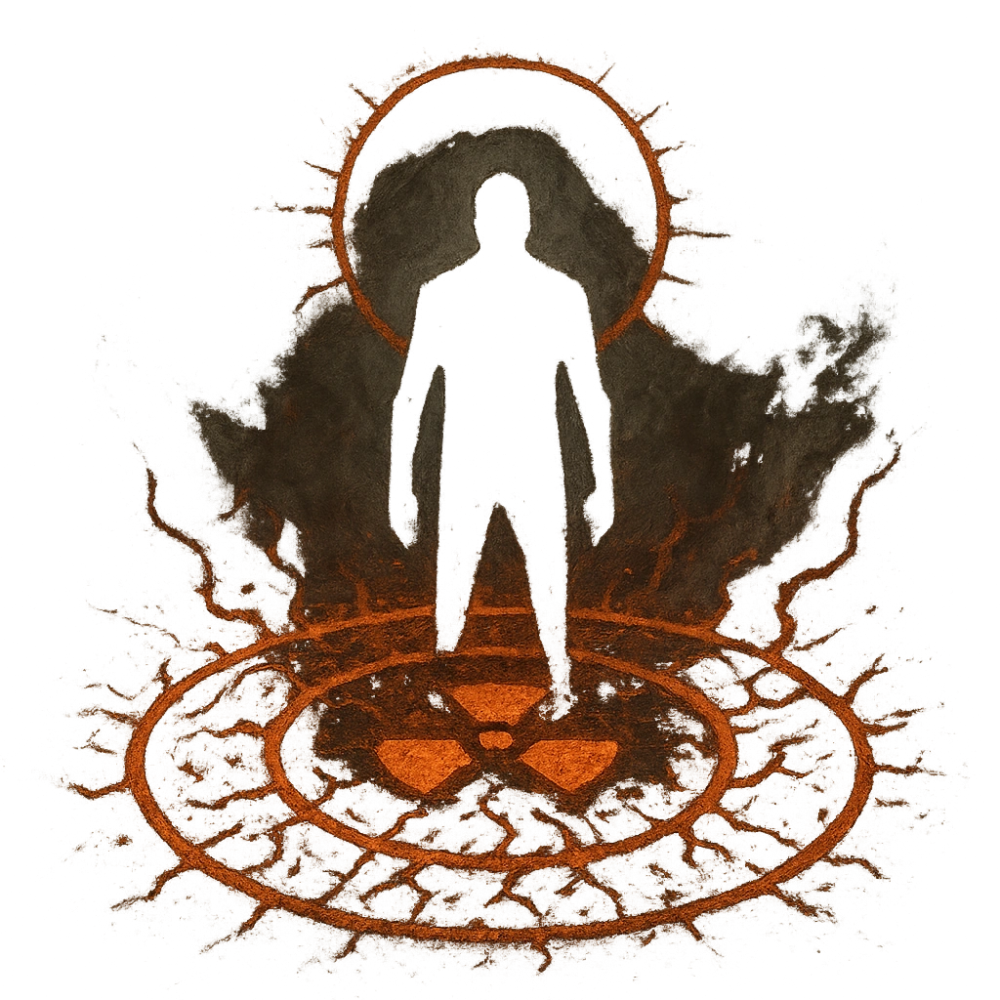

# Circle of Defilement

## Description
*
Countdown (1d8). When the Undefeated Champion is in the spotlight for the fi rst time, activate the countdown. When it triggers, activate a magical circle covering an area within Far range of the Champion. A target within that area is Vulnerable until they leave the circle. The circle can be removed by dealing Severe damage to the Undefeated Champion.
*

## Actions
- 
**Countdown** *Countdown (1d8). When the Undefeated Champion is in the spotlight for the fi rst time, activate the countdown.*

- 
**Circle** *When the countdown triggers, activate a magical circle covering an area within Far range of the Champion. A target within that area is Vulnerable until they leave the circle. The circle can be removed by dealing Severe damage to the Undefeated Champion.*

---

adversaries-features/Solo
 
**UUID:** `Compendium.cybermancy.system.circle-of-defilement`

