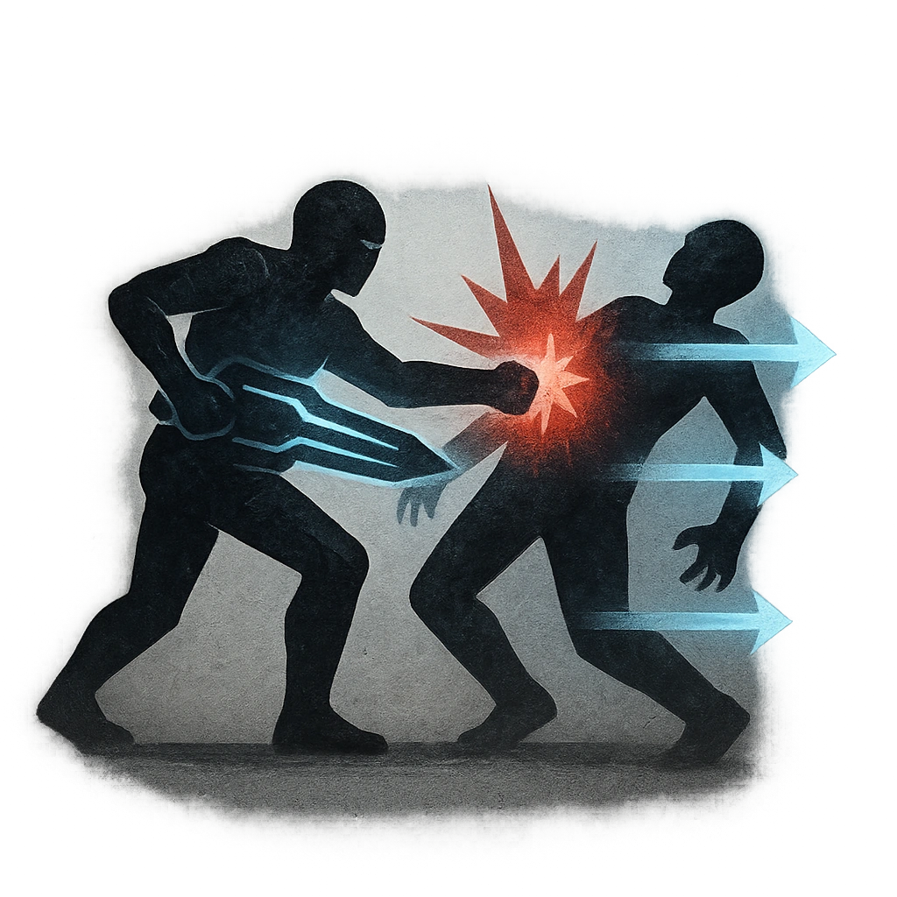

# Clear the Decks

## Description
*
Make an attack against a target within Very Close range. On a success, <strong>mark a Stress</strong> to move into Melee range of the target, dealing <strong>3d4</strong> physical damage and knocking the target back to Close range.
*

## Actions
- 
**Attack** *Make an attack against a target within Very Close range. On a success, mark a Stress to move into Melee range of the target, dealing 3d4 physical damage and knocking the target back to Close range.*

---

adversaries-features/Bruiser
 
**UUID:** `Compendium.cybermancy.system.clear-the-decks`

