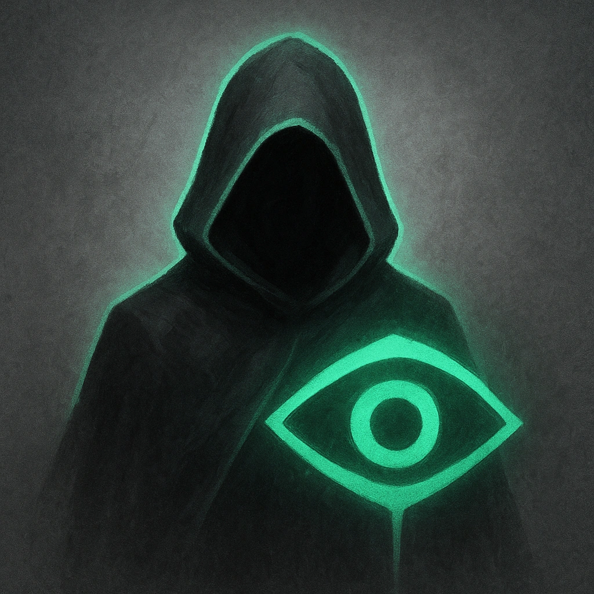

# Cloaked

## Description
*
Become <em>Hidden</em> until after the Shadow’s next attack. Attacks made while Hidden from this feature have advantage.
*

## Actions
- 
**Use** *Become Hidden until after the Shadow’s next attack. Attacks made while Hidden from this feature have advantage.*

---

adversaries-features/Skulk
 
**UUID:** `Compendium.cybermancy.system.cloaked`

