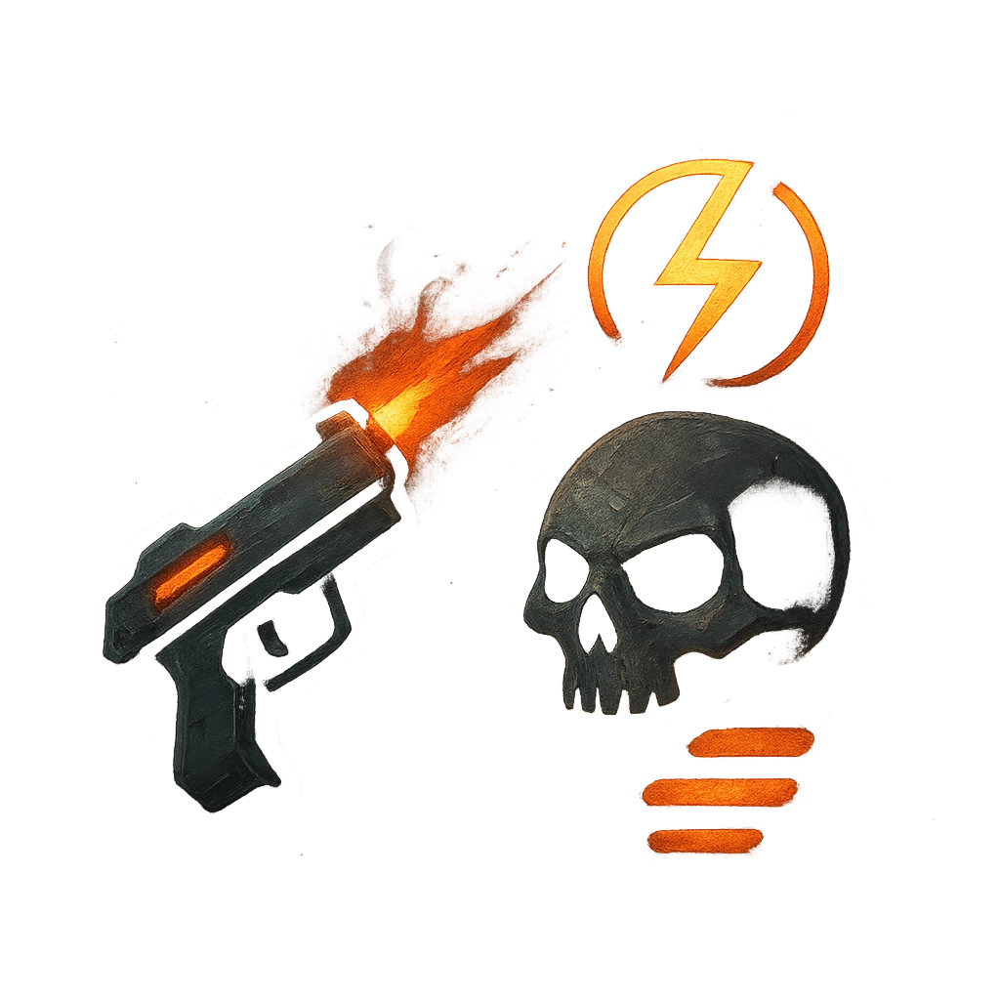

# Concentrate Fire

## Description
*
When another adversary deals damage to a target within Far range of the Turret, you can <strong>mark a Stress</strong> to add the Turret’s standard attack damage to the damage roll.
*

## Actions
- 
**Mark Stress** *When another adversary deals damage to a target within Far range of the Turret, you can mark a Stress to add the Turret’s standard attack damage to the damage roll.*

---

adversaries-features/Ranged
 
**UUID:** `Compendium.cybermancy.system.concentrate-fire`

