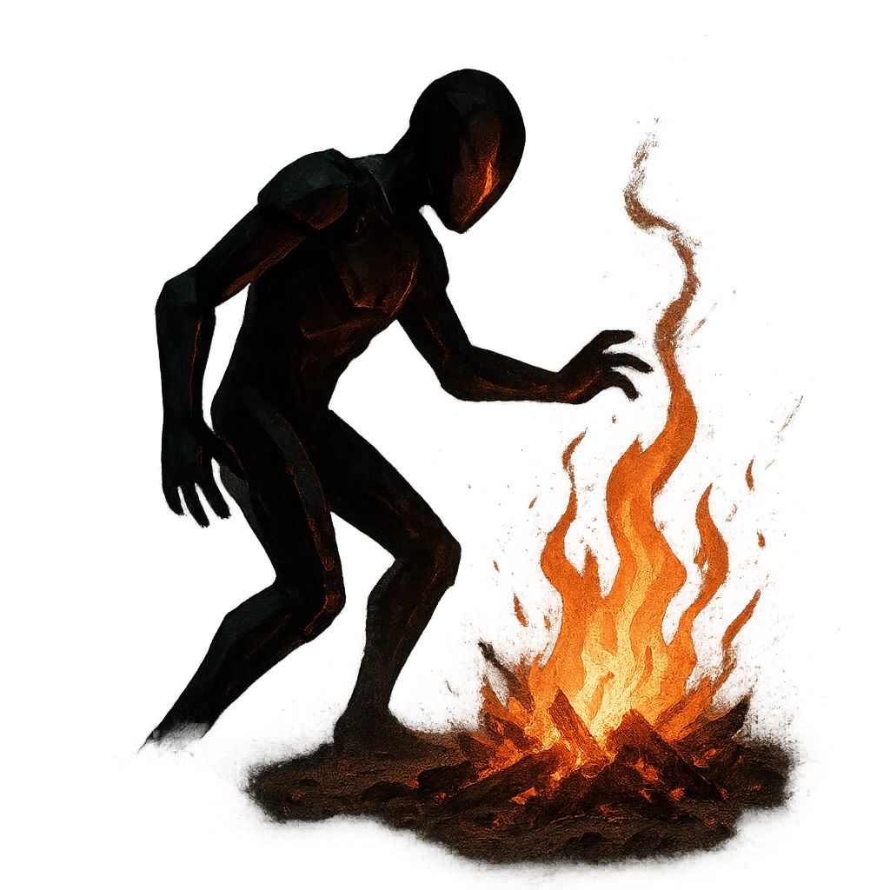

# Consume Kindling

## Description
*
Three times per scene, when the Elemental moves onto objects that are highly flammable, consume them to clear a HP or a Stress.
*

## Actions
- 
**Heal HP** *Three times per scene, when the Elemental moves onto objects that are highly flammable, consume them to clear a HP or a Stress.*

- 
**Healing** *Three times per scene, when the Elemental moves onto objects that are highly flammable, consume them to clear a HP or a Stress.*

---

adversaries-features/Solo
 
**UUID:** `Compendium.cybermancy.system.consume-kindling`

