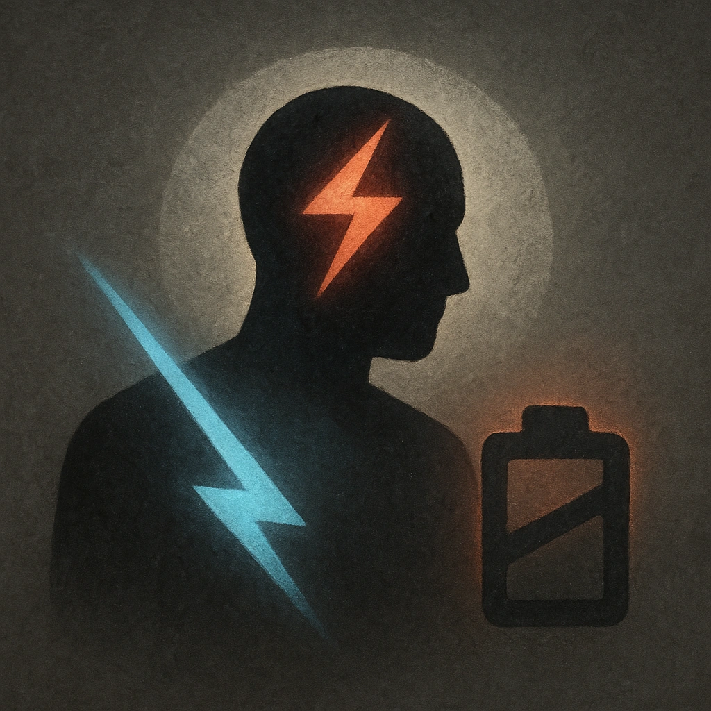

# Cornered

## Description
*
<strong>Mark a Stress</strong> instead of spending a Fear to spotlight the Ashen Tyrant.
*

## Actions
- 
**Mark Stress** *Mark a Stress instead of spending a Fear to spotlight the Ashen Tyrant.*

---

adversaries-features/Solo
 
**UUID:** `Compendium.cybermancy.system.cornered`

