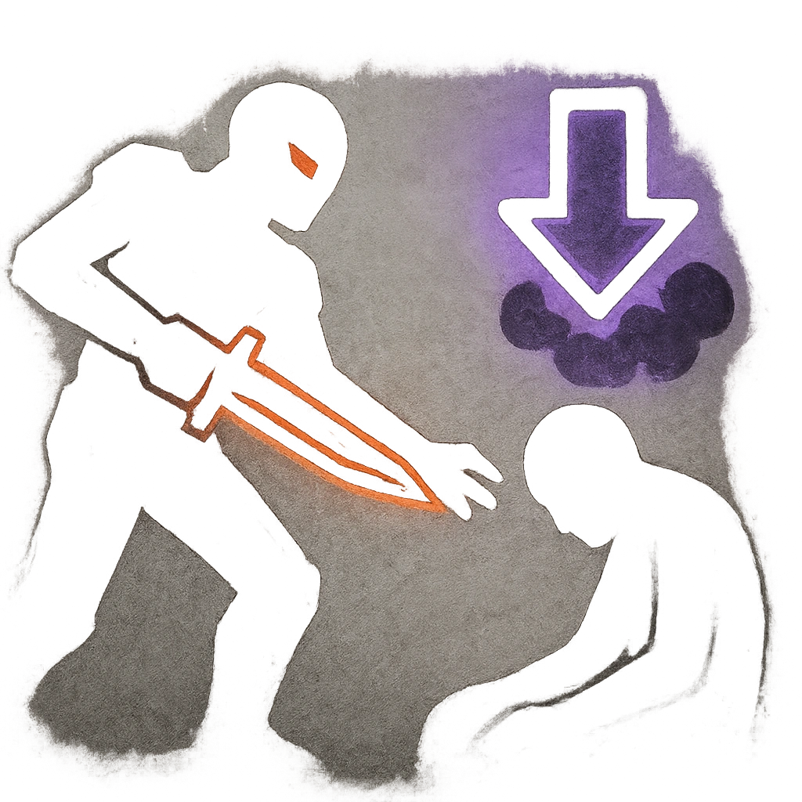

# Coup de Grace

## Description
*
<strong>Spend a Fear</strong> to make an attack against a Vulnerable target within Close range. On a success, deal <strong>2d6+12</strong> physical damage and the target must mark a Stress.
*

## Actions
- 
**Attack** *Spend a Fear to make an attack against a Vulnerable target within Close range. On a success, deal 2d6+12 physical damage and the target must mark a Stress.*

---

adversaries-features/Leader
 
**UUID:** `Compendium.cybermancy.system.coup-de-grace`

