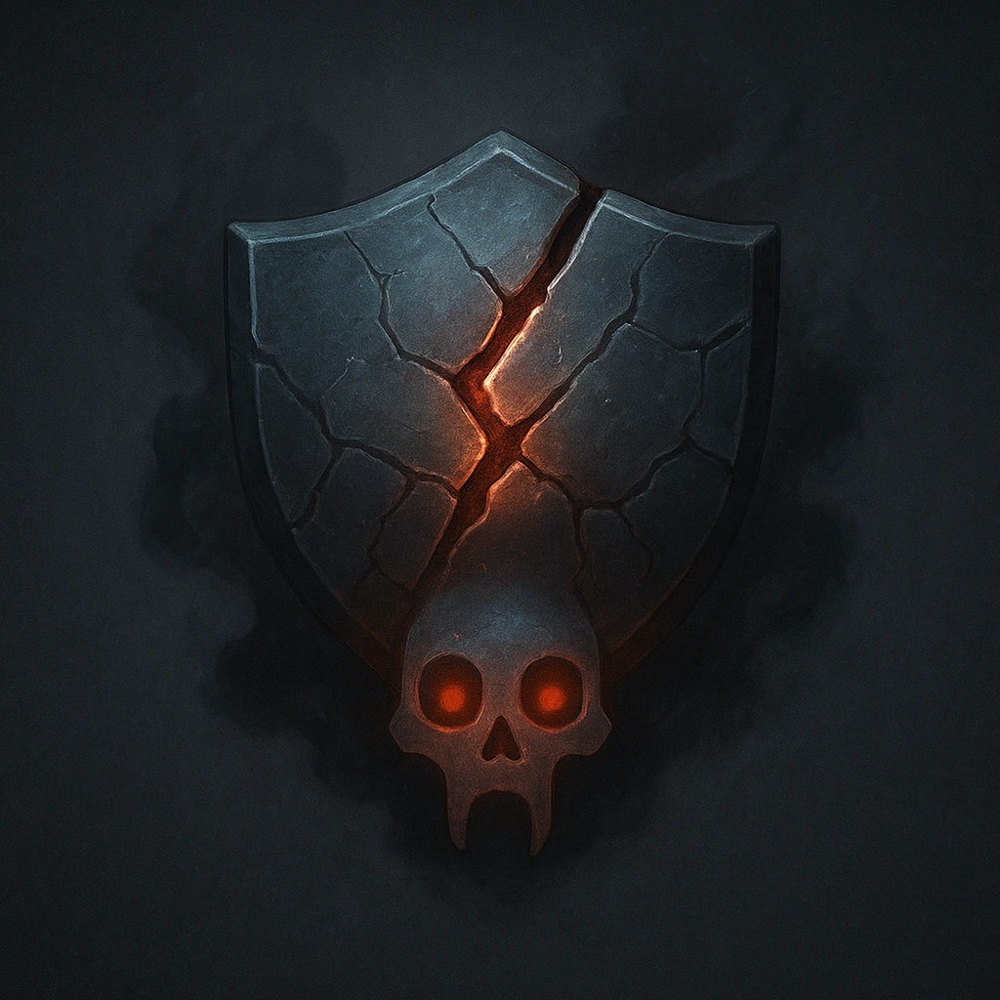

# Cracked Scales

## Description
*
When the Molten Scourge takes damage, roll a number of d6s equal to HP marked. For each result of 4 or higher, you gain a Fear.
*

## Actions
—

---

adversaries-features/Solo
 
**UUID:** `Compendium.cybermancy.system.cracked-scales`

