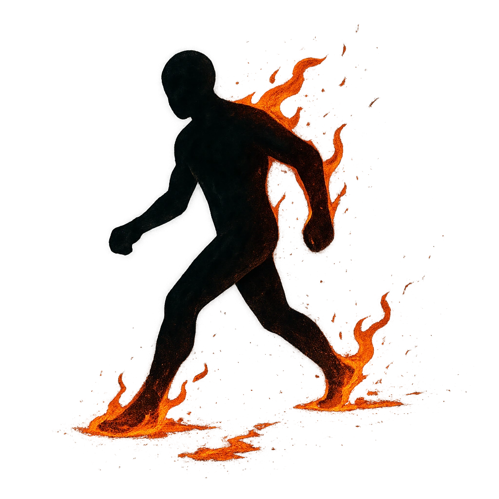

# Creeping Fire

## Description
*
The Ooze can only move within Very Close range as their normal movement. They light any flammable object they touch on fi re.
*

## Actions
—

---

adversaries-features/Skulk
 
**UUID:** `Compendium.cybermancy.system.creeping-fire`

