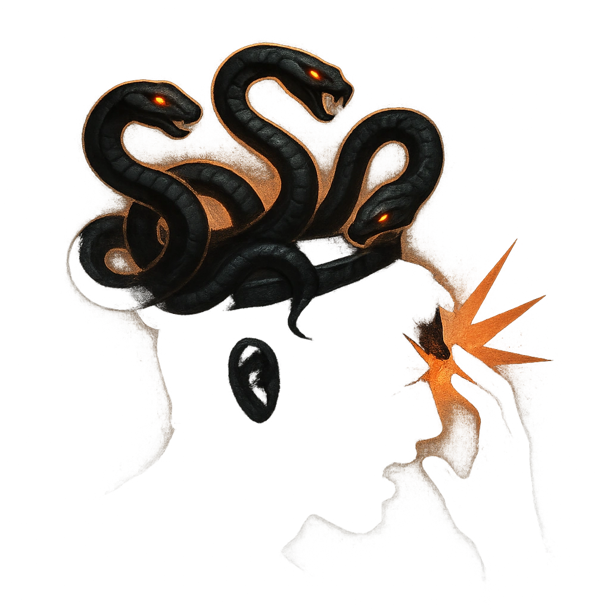

# Crown of Serpents

## Description
*
Make an attack roll against a target within Melee range using the Gorgon’s protective snakes. On a success, mark a Stress to deal <strong>2d10+4</strong> physical damage and the target must mark a Stress.
*

## Actions
- 
**Attack** *Make an attack roll against a target within Melee range using the Gorgon’s protective snakes. On a success, mark a Stress to deal 2d10+4 physical damage and the target must mark a Stress.*

---

adversaries-features/Solo
 
**UUID:** `Compendium.cybermancy.system.crown-of-serpents`

