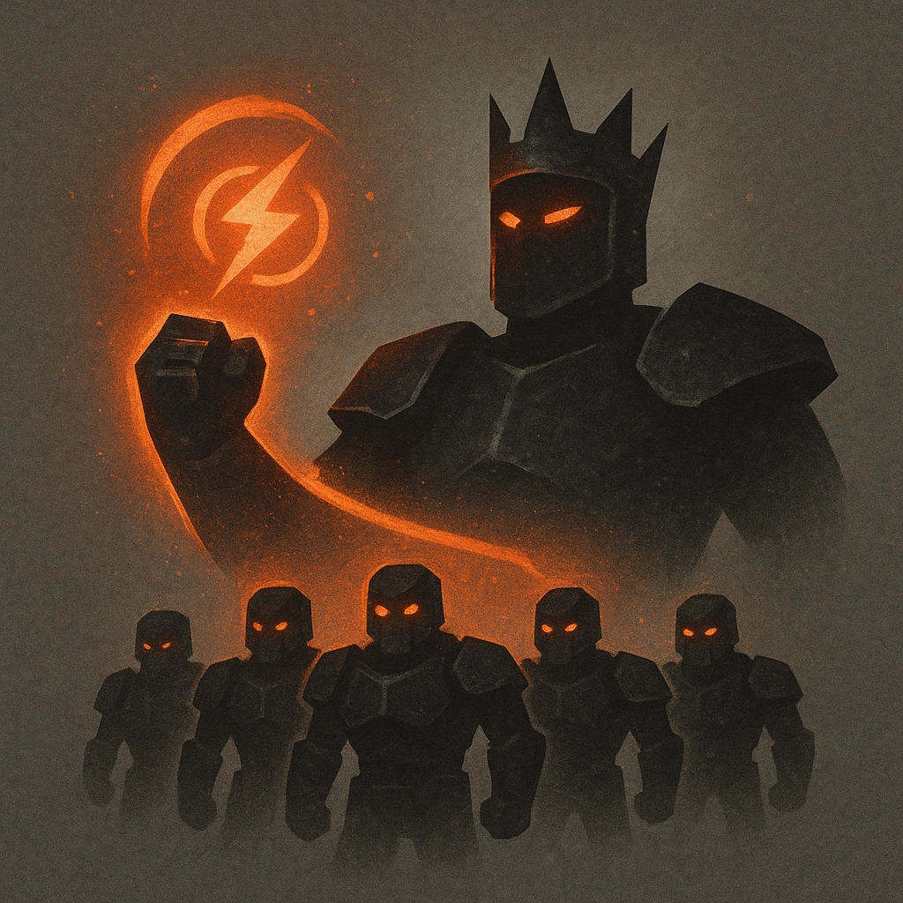

# Crownsguard

## Description
*
Once per scene, <strong>mark a Stress</strong> to summon six Tier 3 Minions, who appear at Close range to enforce the Monarch’s will.
*

## Actions
- 
**Mark Stress** *Once per scene, mark a Stress to summon six Tier 3 Minions, who appear at Close range to enforce the Monarch’s will.*

---

adversaries-features/Social
 
**UUID:** `Compendium.cybermancy.system.crownsguard`

