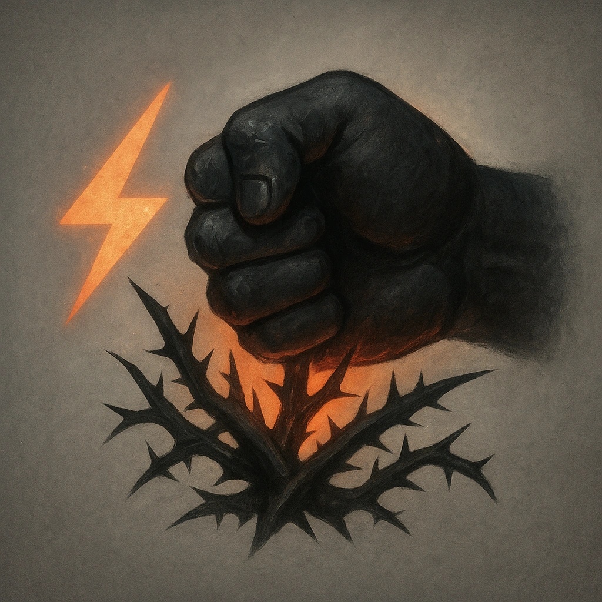

# Crush

## Description
*
<strong>Mark a Stress</strong> to deal <strong>2d6+8</strong> direct physical damage to a target with 3 or more bramble tokens.
*

## Actions
- 
**Damage** *Mark a Stress to deal 2d6+8 direct physical damage to a target with 3 or more bramble tokens.*

---

adversaries-features/Horde
 
**UUID:** `Compendium.cybermancy.system.crush`

