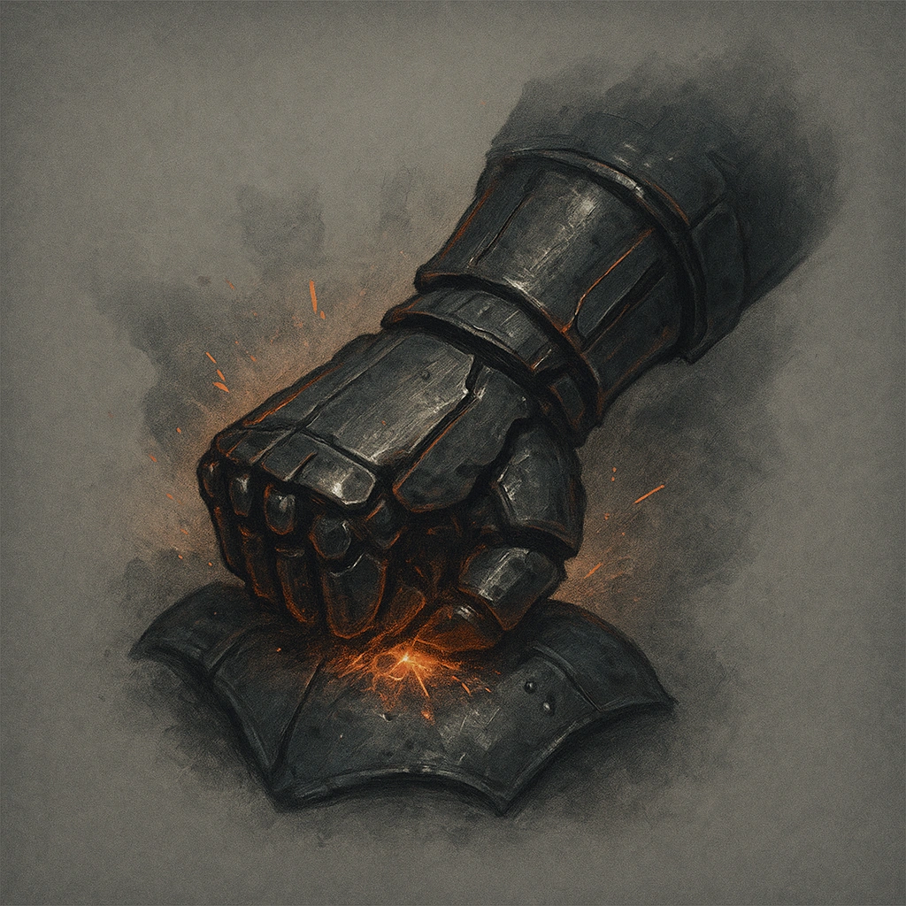

# Crushing Blows

## Description
*
When the Elemental makes a successful attack, the target must mark an Armor Slot without receiving its benefi ts (they can still use armor to reduce the damage). If they can’t mark an Armor Slot, they must mark an additional HP.
*

## Actions
- 
**Damage Armor** *When the Elemental makes a successful attack, the target must mark an Armor Slot without receiving its benefi ts (they can still use armor to reduce the damage). If they can’t mark an Armor Slot, they must mark an additional HP.*

---

adversaries-features/Bruiser
 
**UUID:** `Compendium.cybermancy.system.crushing-blows`

