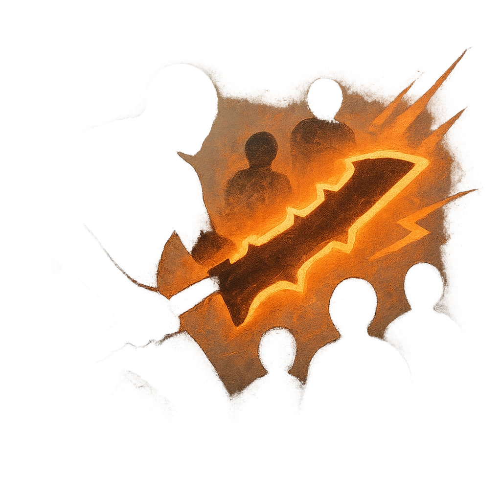

# Cut to the Bone

## Description
*
<strong>Mark a Stress</strong> to make an attack against all targets within Very Close range. Targets the Knight succeeds against take <strong>1d8+2</strong> physical damage and must mark a Stress.

@Template[type:emanation|range:vc]
*

## Actions
- 
**Attack** *vc]*

---

adversaries-features/Bruiser
 
**UUID:** `Compendium.cybermancy.system.cut-to-the-bone`

