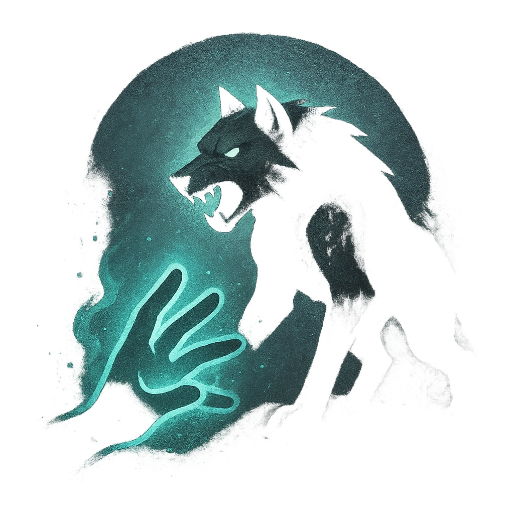

# Deadly Companion

## Description
*
Twice per scene, summon a Bear, Dire Wolf, or similar Tier 1 animal adversary under the Beastmaster’s control. The adversary appears at Close range and is immediately spotlighted.
*

## Actions
- 
**Summon** *Twice per scene, summon a @UUID[Compendium.daggerheart.adversaries.Actor.71qKDLKO3CsrNkdy]{Bear}, @UUID[Compendium.daggerheart.adversaries.Actor.wNzeuQLfLUMvgHlQ]{Dire Wolf} or similar Tier 1 animal adversary under the Beastmaster’s control. The adversary appears at Close range and is immediately spotlighted.*

---

adversaries-features/Leader
 
**UUID:** `Compendium.cybermancy.system.deadly-companion`

