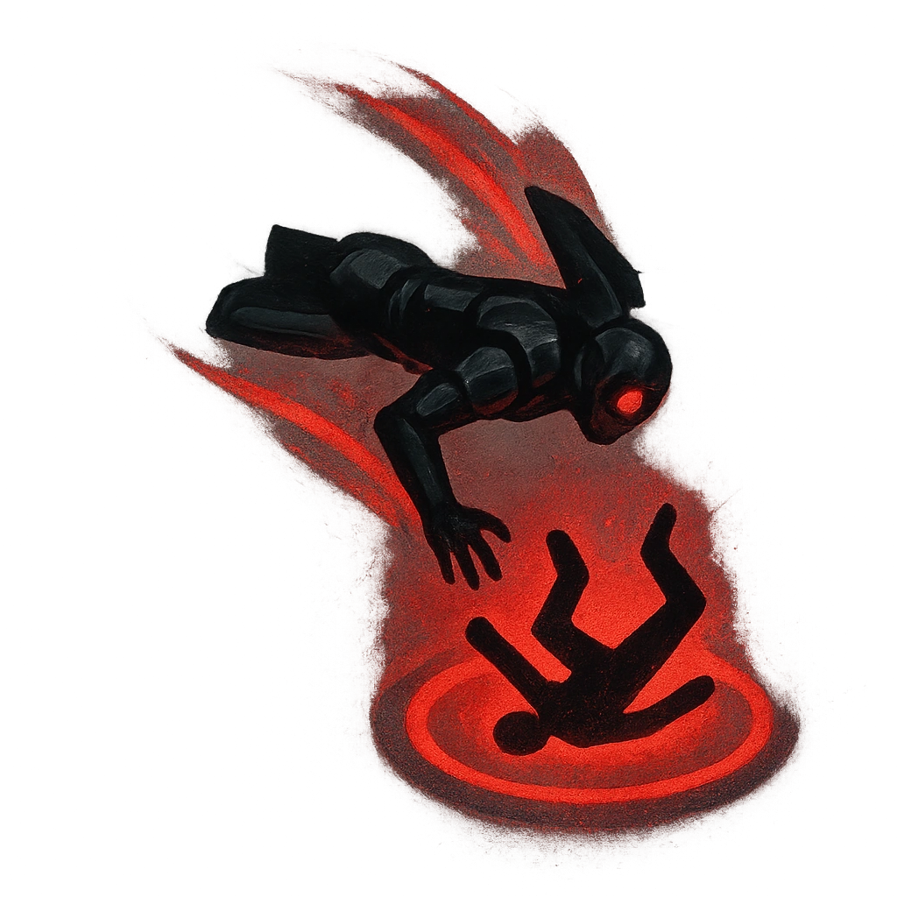

# Deadly Dive

## Description
*
<strong>Mark a Stress</strong> to attack a target within Far range. On a success, deal <strong>2d10+2</strong> physical damage and knock the target over, making them <em>Vulnerable</em> until they next act.
*

## Actions
- 
**Attack** *Mark a Stress to attack a target within Far range. On a success, deal 2d10+2 physical damage and knock the target over, making them Vulnerable until they next act.*

---

adversaries-features/Skulk
 
**UUID:** `Compendium.cybermancy.system.deadly-dive`

