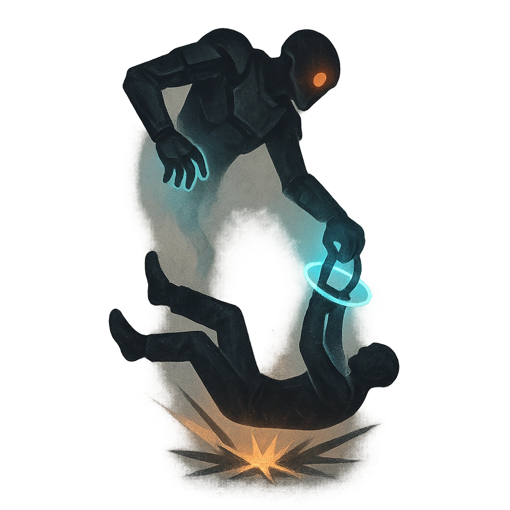

# Deadly Drop

## Description
*
While flying, the Eagle can drop a Restrained target they are holding. When dropped, the target is no longer Restrained but starts falling. If their fall isn’t prevented during the PCs’ next action, the target takes <strong>2d20</strong> physical damage when they land.
*

## Actions
- 
**Damage** *While flying, the Eagle can drop a Restrained target they are holding. When dropped, the target is no longer Restrained but starts falling. If their fall isn’t prevented during the PCs’ next action, the target takes 2d20 physical damage when they land.*

---

adversaries-features/Skulk
 
**UUID:** `Compendium.cybermancy.system.deadly-drop`

