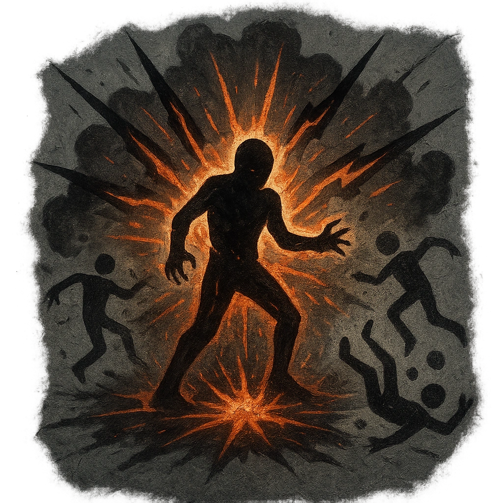

# Death Quake

## Description
*
When the Box marks their last HP, the magic powering them ruptures in an explosion of force. All targets within Close range must succeed on an Instinct Reaction Roll or take <strong>2d8+1</strong> magic damage

@Template[type:emanation|range:c]
*

## Actions
- 
**Roll Save** *c]*

---

adversaries-features/Solo
 
**UUID:** `Compendium.cybermancy.system.death-quake`

