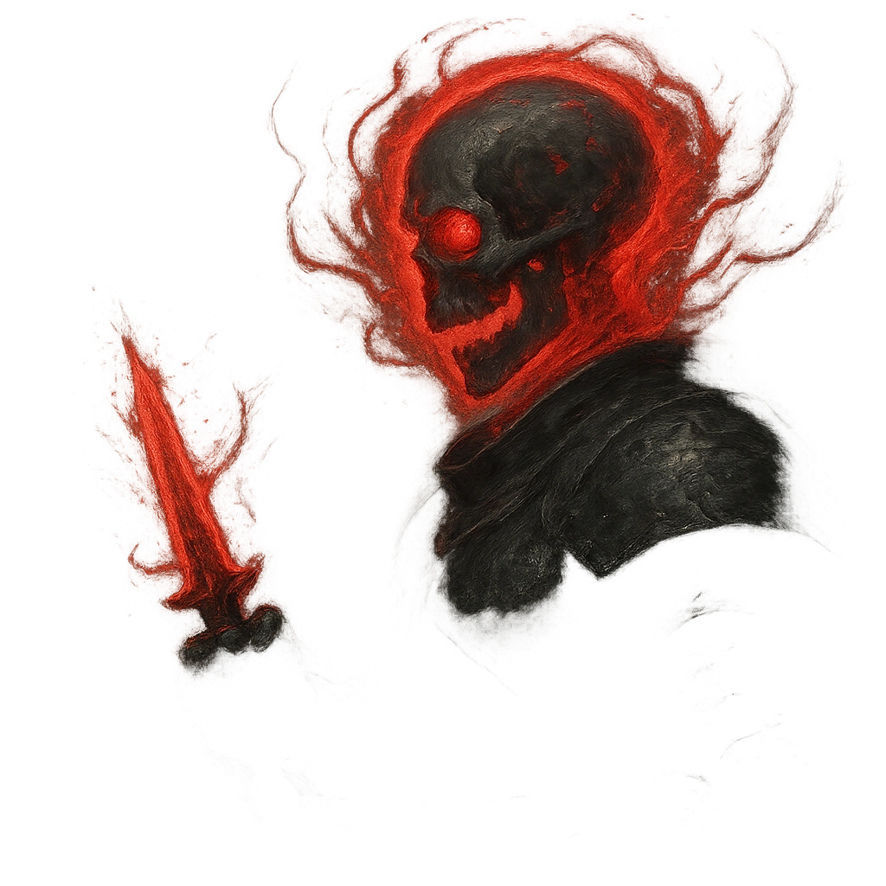

# Deathlock

## Description
*
<strong>Spend a Fear</strong> to curse a target within Very Close range with a necrotic Deathlock until the end of the scene. Attacks made by the Hunter against a Deathlocked target deal direct damage. The Hunter can only maintain one Deathlock at a time.
*

## Actions
- 
**Curse** *Spend a Fear to curse a target within Very Close range with a necrotic Deathlock until the end of the scene. Attacks made by the Hunter against a Deathlocked target deal direct damage. The Hunter can only maintain one Deathlock at a time.*

---

adversaries-features/Leader
 
**UUID:** `Compendium.cybermancy.system.deathlock`

