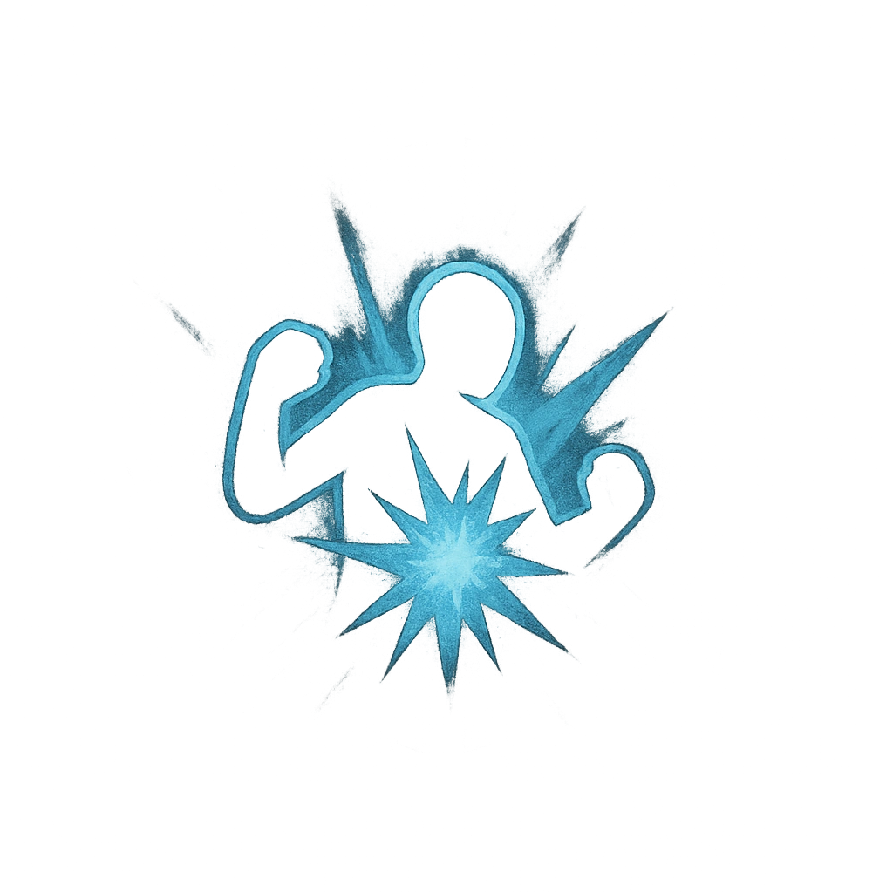

# Desperate Rampage

## Description
*
<strong>Mark a Stress</strong> to make an attack against all targets within Close range. Targets the Ashen Tyrant succeeds against take <strong>2d20+2</strong> physical damage, are knocked back to Close range of where they were, and must mark a Stress.

@Template[type:emanation|range:c]
*

## Actions
- 
**Attack** *c]*

---

adversaries-features/Solo
 
**UUID:** `Compendium.cybermancy.system.desperate-rampage`

