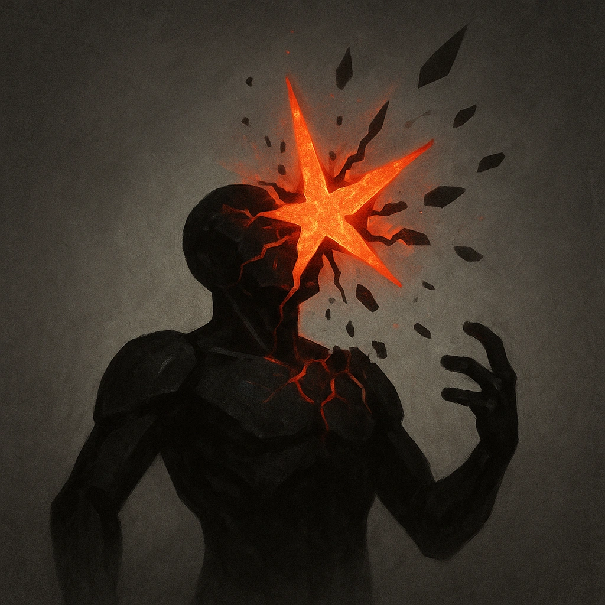

# Destructible

## Description
*
When the Zombie takes Major or greater damage, they mark an additional HP.
*

## Actions
—

---

adversaries-features/Solo
 
**UUID:** `Compendium.cybermancy.system.destructible`

