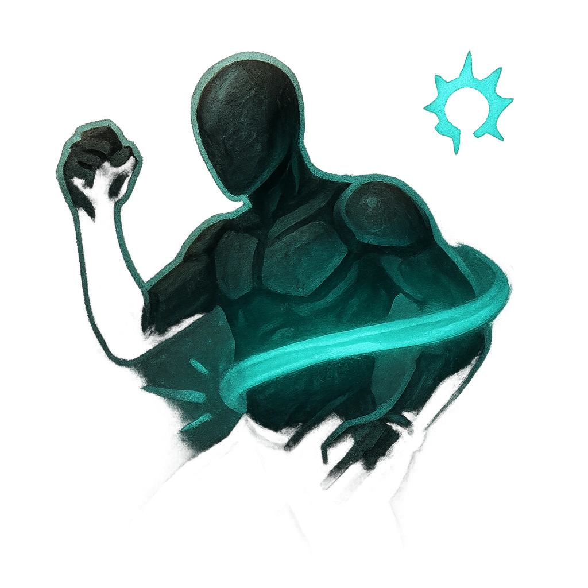

# Detain

## Description
*
Make an attack against a target within Very Close range. On a success, <strong>mark a Stress</strong> to Restrain the target until they break free with a successful attack, Finesse Roll, or Strength Roll.
*

## Actions
- 
**Attack** *Make an attack against a target within Very Close range. On a success, mark a Stress to Restrain the target until they break free with a successful attack, Finesse Roll, or Strength Roll.*

---

adversaries-features/Standard
 
**UUID:** `Compendium.cybermancy.system.detain`

