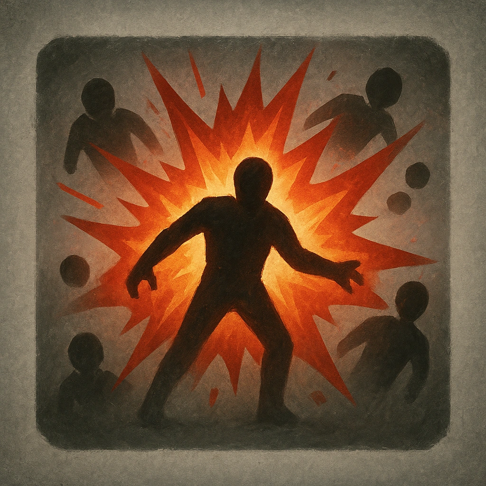

# Detonation

## Description
*
When the Turret is destroyed, they explode. All targets within Close range must make an Agility Reaction Roll. Targets who fail take <strong>3d20</strong> physical damage. Targets who succeed take half damage.

@Template[type:emanation|range:c]
*

## Actions
- 
**Roll Save** *c]*

---

adversaries-features/Ranged
 
**UUID:** `Compendium.cybermancy.system.detonation`

