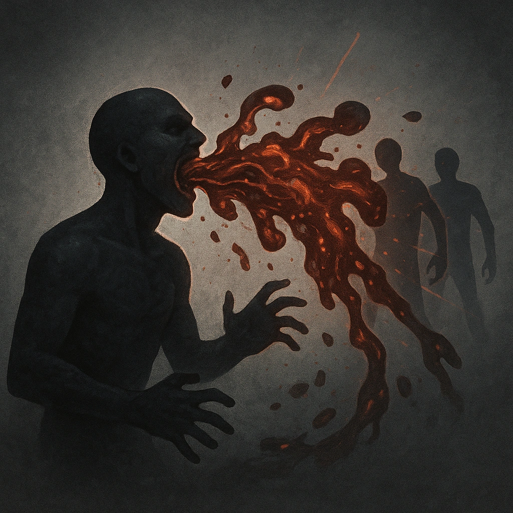

# Disgorge Realiy Flotsam

## Description
*
<strong>Mark a Stress</strong> to spew partially digested portions of consumed realities at all targets within Close range. Targets must succeed on a Knowledge Reaction Roll or mark 2 Stress.

@Template[type:emanation|range:c]
*

## Actions
- 
**Roll Save** *c]*

---

adversaries-features/Support
 
**UUID:** `Compendium.cybermancy.system.disgorge-realiy-flotsam`

