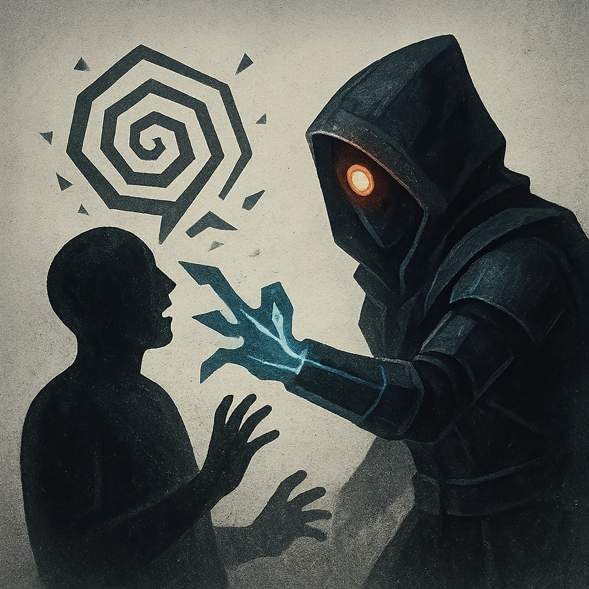

# Disorienting Presence

## Description
*
When a target takes damage from the Abomination, they must make an Instinct Reaction Roll. On a failure, they gain disadvantage on their next action roll and you gain a Fear.
*

## Actions
- 
**Roll Save** *When a target takes damage from the Abomination, they must make an Instinct Reaction Roll. On a failure, they gain disadvantage on their next action roll and you gain a Fear.*

---

adversaries-features/Bruiser
 
**UUID:** `Compendium.cybermancy.system.disorienting-presence`

