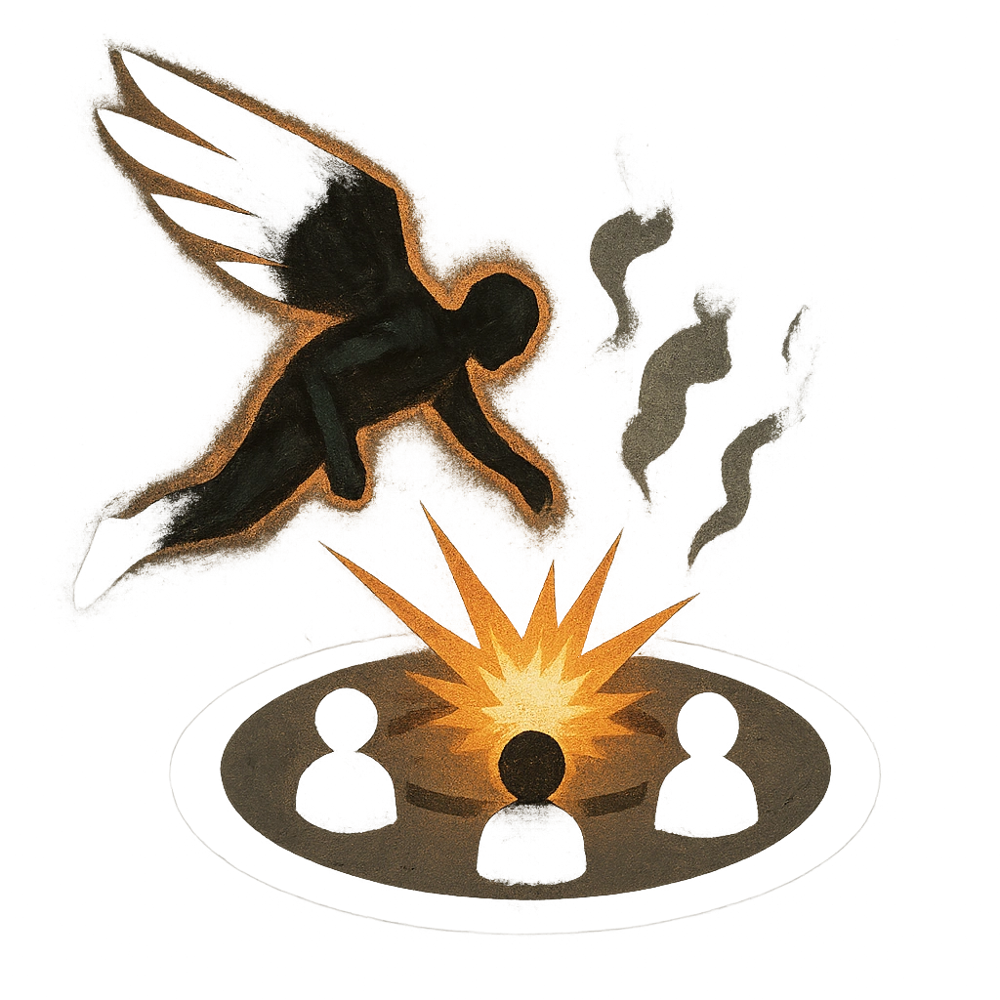

# Dive-Bomb

## Description
*
If the Obsidian Predator is flying, mark a <strong>Stress</strong> to choose a point within Far range. Move to that point and make an attack against all targets within Very Close range. Targets the Obsidian Predator succeeds against take <strong>2d10+6</strong> physical damage and must mark a Stress and lose a Hope.

@Template[type:emanation|range:vc]
*

## Actions
- 
**Attack** *vc]*

---

adversaries-features/Solo
 
**UUID:** `Compendium.cybermancy.system.dive-bomb`

