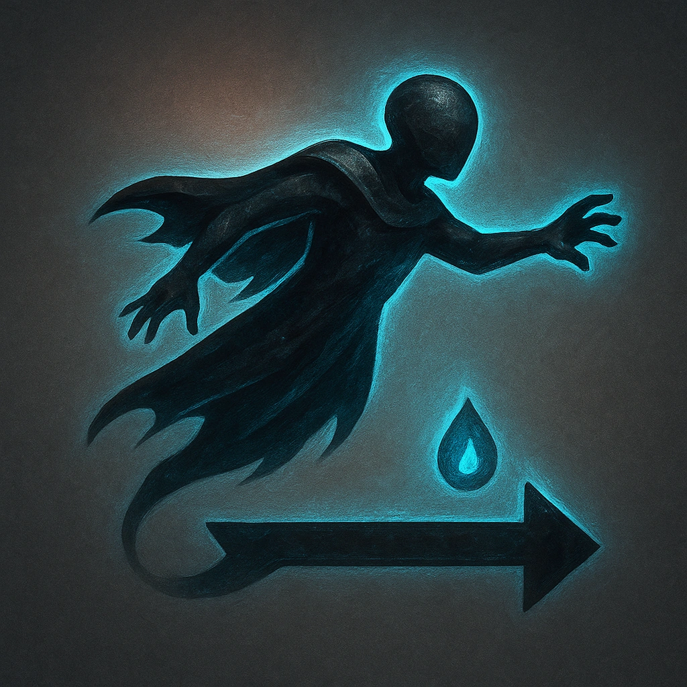

# Divine Flight

## Description
*
While the Soldier is flying, <strong>spend a Fear</strong> to move up to Far range instead of Close range before taking an action.
*

## Actions
- 
**Spend Fear** *While the Soldier is flying, spend a Fear to move up to Far range instead of Close range before taking an action.*

---

adversaries-features/Minion
 
**UUID:** `Compendium.cybermancy.system.divine-flight`

