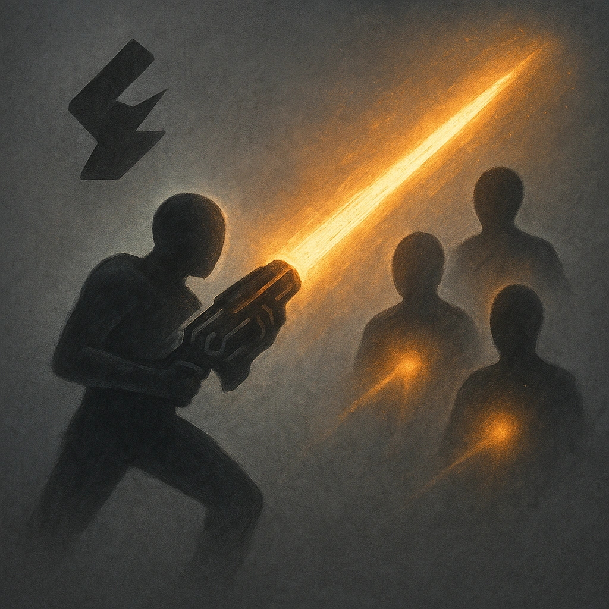

# Divine Volley

## Description
*
<strong>Mark a Stress</strong> to make a standard attack against up to three targets.
*

## Actions
- 
**Attack** *Mark a Stress to make a standard attack against up to three targets.*

---

adversaries-features/Ranged
 
**UUID:** `Compendium.cybermancy.system.divine-volley`

