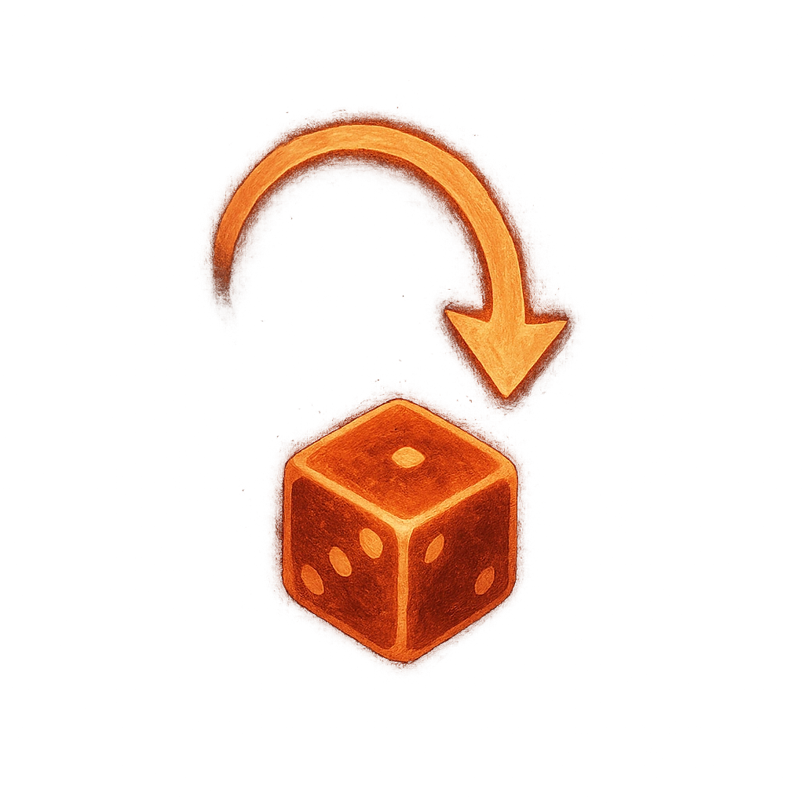

# Double or Nothing

## Description
*
When a PC within Far range fails a roll, they can choose to reroll their Fear Die and take the new result. If they still fail, they mark 2 Stress and the Demon clears a Stress.
*

## Actions
- 
**Mark Stress** *When a PC within Far range fails a roll, they can choose to reroll their Fear Die and take the new result. If they still fail, they mark 2 Stress and the Demon clears a Stress.*

---

adversaries-features/Leader
 
**UUID:** `Compendium.cybermancy.system.double-or-nothing`

