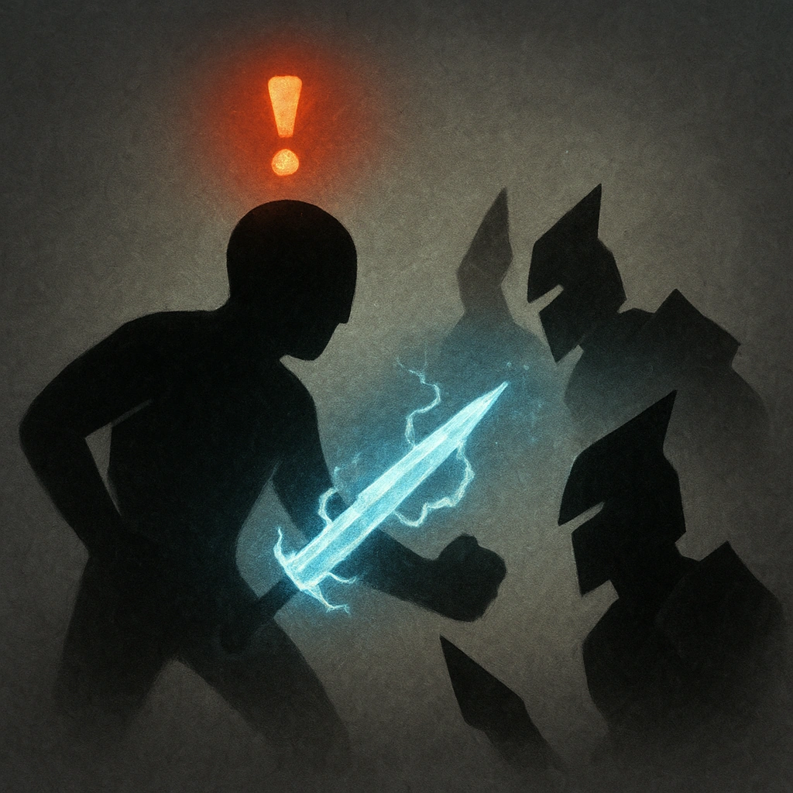

# Double Strike

## Description
*
<strong>Mark a Stress</strong> to make a standard attack against two targets within Melee range.
*

## Actions
- 
**Attack** *Mark a Stress to make a standard attack against two targets within Melee range.*

---

adversaries-features/Bruiser
 
**UUID:** `Compendium.cybermancy.system.double-strike`

