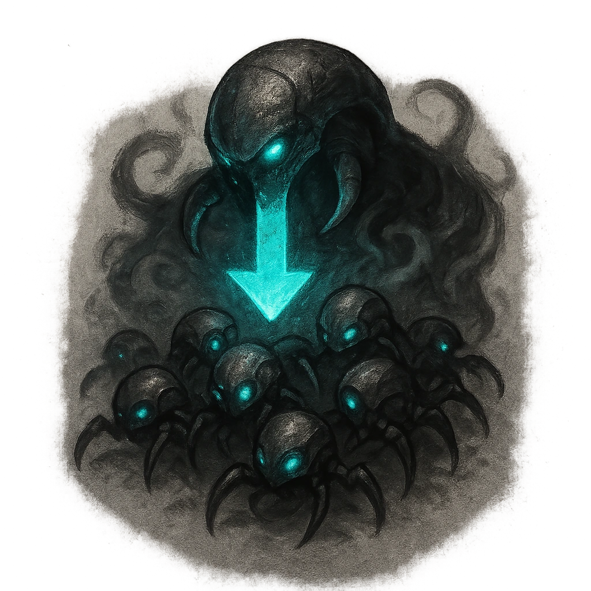

# Drain and Multiply

## Description
*
When an attack from the Bramble causes a target to mark HP and there are three or more Tangle Bramble Minions within Close range, you can combine the Minions into a @UUID[Compendium.daggerheart.adversaries.Actor.PKSXFuaIHUCoH63A]{Tangle Bramble Swarm Horde}. The Horde’s HP is equal to the number of Minions combined.
*

## Actions
—

---

adversaries-features/Minion
 
**UUID:** `Compendium.cybermancy.system.drain-and-multiply`

