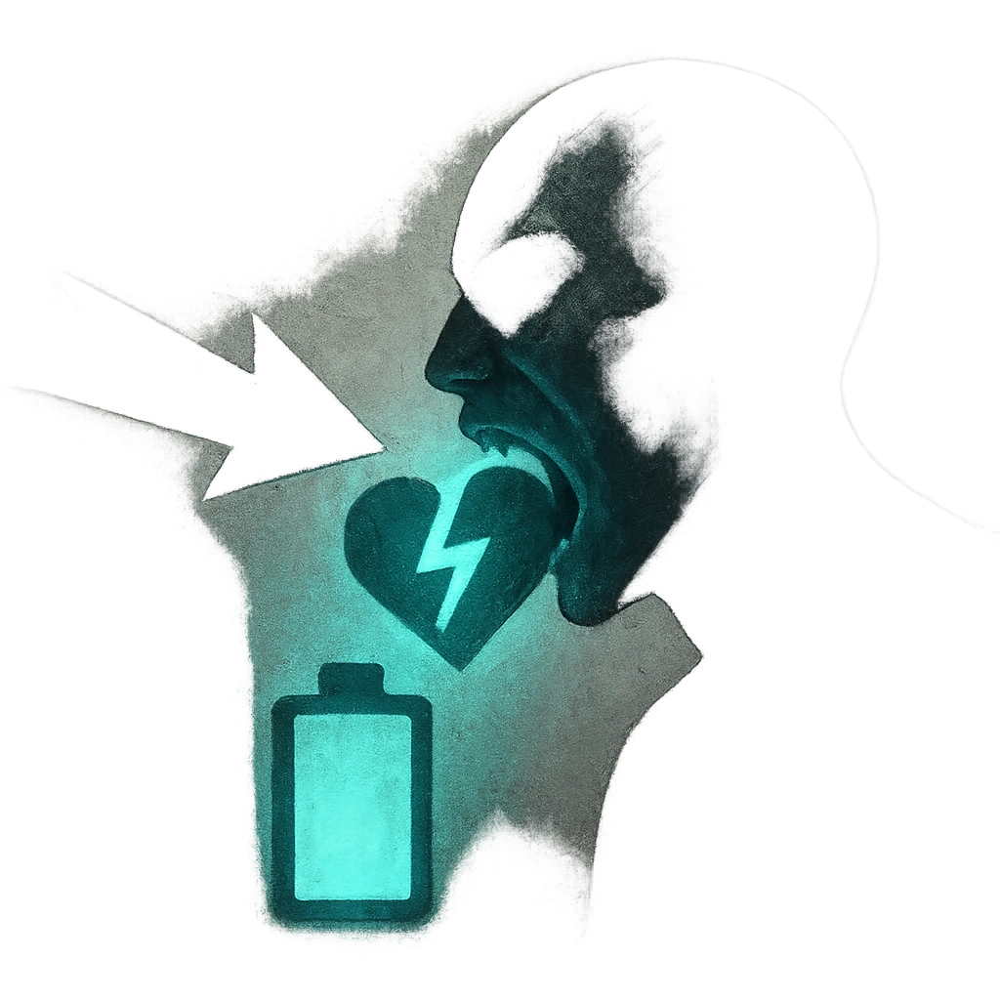

# Draining Bite

## Description
*
Make an attack against a target within Melee range. On a success, deal <strong>5d4</strong> physical damage. A target who marks HP from this attack loses a Hope and must mark a Stress. The Vampire then clears a HP.
*

## Actions
- 
**Attack** *Make an attack against a target within Melee range. On a success, deal 5d4 physical damage. A target who marks HP from this attack loses a Hope and must mark a Stress. The Vampire then clears a HP.*

---

adversaries-features/Standard
 
**UUID:** `Compendium.cybermancy.system.draining-bite`

