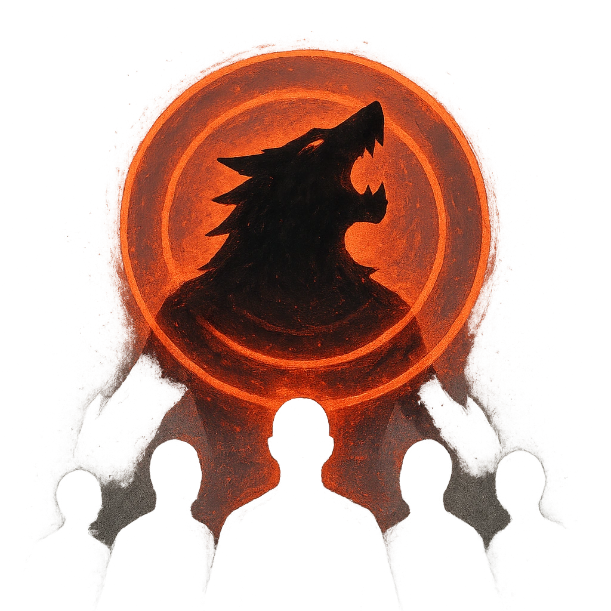

# Dreadhowl

## Description
*
<strong>Mark a Stress</strong> to make all targets within Very Close range lose a Hope. If a target is not able to lose a Hope, they must instead mark 2 Stress.

@Template[type:emanation|range:vc]
*

## Actions
- 
**Lose Hope** *vc]*

---

adversaries-features/Horde
 
**UUID:** `Compendium.cybermancy.system.dreadhowl`

